# 論文収集・変換ツール使用例

このドキュメントでは、論文収集・変換ツールの具体的な使用例を紹介します。

## 📚 基本的なワークフロー

### 1. 論文検索・収集 → 2. PDF変換 → 3. マークダウン活用

```mermaid
graph LR
    A[論文検索] --> B[PDFダウンロード] --> C[マークダウン変換] --> D[研究活用]
```



## 🔍 論文収集の使用例

### ケース1: 特定の著者の論文を収集

```bash
# Maxwell Ramsteadの論文を検索・収集
cd /path/to/institute/tools/paper-collector
python search_ramstead.py
```

**実行結果例:**
```
=== Searching papers by Ramstead ===

Found 10 papers on Google Scholar

--- Paper 1 ---
Title: Neural and phenotypic representation under the free-energy principle
Authors: MJD Ramstead, C Hesp, A Tschantz, R Smith…
Published: 2021

収集完了！
収集した論文数: 10
保存先: /institute/library/author_search/Ramstead
```

### ケース2: 意識研究論文の包括的収集

```bash
# 意識研究に関するすべてのキーワードで検索
python paper_collector.py
```

**検索されるキーワード:**
- consciousness
- awareness  
- phenomenology
- qualia
- integrated information theory (IIT)
- global workspace theory
- neural correlates consciousness (NCC)
- subjective experience

### ケース3: カスタムキーワードで検索

```python
from paper_collector import PaperCollector

# カスタム検索
collector = PaperCollector("custom_papers")

# Free Energy Principleに関する論文
papers = collector.search_arxiv("free energy principle", max_results=20)

# 特定の著者 + キーワード
papers = collector.search_arxiv('au:"Karl Friston" AND all:consciousness', max_results=15)

# Google Scholarでも検索
scholar_papers = collector.search_google_scholar(
    "active inference consciousness phenomenology", 
    num_results=10
)
```

## 📄 PDF変換の使用例

### ケース1: 収集した論文のPDFを一括変換

```bash
# Ramsteadの論文をすべてマークダウンに変換
python batch_convert.py --author "Ramstead"
```

**実行結果例:**
```
📊 Batch Conversion Results:
Directories processed: 1/1
Total files: 3
Successful conversions: 3
Failed conversions: 0
Success rate: 100.0%

📁 Converted directories:
  - Ramstead: 3/3 files
```

### ケース2: 特定のディレクトリのPDFを変換

```bash
# 特定のディレクトリを指定
python batch_convert.py --directory "/institute/library/author_search/Ramstead/pdfs"
```

### ケース3: 単一PDFファイルの変換

```bash
# 1つのPDFファイルを変換
python pdf_to_markdown.py /path/to/pdfs --single_file consciousness_paper.pdf
```

### ケース4: すべての収集済みPDFを一括変換

```bash
# 研究所ライブラリ内のすべてのPDFを変換
python batch_convert.py
```

**実行結果例:**
```
📊 Batch Conversion Results:
Directories processed: 5/5
Total files: 47
Successful conversions: 45
Failed conversions: 2
Success rate: 95.7%

📁 Converted directories:
  - Ramstead: 10/10 files
  - collected_papers: 20/22 files
  - consciousness_lab: 15/15 files
```

## 🔧 プログラムからの使用例

### Python スクリプトでの自動化

```python
#!/usr/bin/env python3
"""
意識研究論文の自動収集・変換パイプライン
"""

from paper_collector import PaperCollector
from pdf_to_markdown import PDFToMarkdownConverter
from pathlib import Path
import time

def automated_research_pipeline():
    """研究論文の自動処理パイプライン"""
    
    # 1. 論文収集
    print("🔍 Starting paper collection...")
    collector = PaperCollector("consciousness_research_2025")
    
    # 特定のキーワードで検索
    keywords = [
        "consciousness neural correlates",
        "phenomenology computational",
        "qualia artificial intelligence",
        "integrated information theory 2024"
    ]
    
    all_papers = []
    for keyword in keywords:
        papers = collector.search_arxiv(keyword, max_results=10)
        all_papers.extend(papers)
        time.sleep(2)  # API制限対策
    
    print(f"📚 Collected {len(all_papers)} papers")
    
    # 2. PDF変換
    print("🔄 Starting PDF conversion...")
    pdf_dir = Path("consciousness_research_2025/pdfs")
    
    if pdf_dir.exists() and list(pdf_dir.glob("*.pdf")):
        converter = PDFToMarkdownConverter(
            str(pdf_dir), 
            str(pdf_dir.parent / "markdown")
        )
        
        results = converter.convert_all_pdfs()
        summary = converter.get_conversion_summary()
        
        print(f"✅ Conversion complete:")
        print(f"   Success rate: {summary['success_rate']:.1f}%")
        print(f"   Total pages: {summary['total_pages_converted']}")
    
    # 3. 研究ノートの生成
    generate_research_notes(all_papers, summary)

def generate_research_notes(papers, conversion_summary):
    """研究ノートの自動生成"""
    notes = f"""# 意識研究論文レビュー {time.strftime('%Y-%m-%d')}

## 収集サマリー
- 論文数: {len(papers)}
- 変換成功率: {conversion_summary.get('success_rate', 0):.1f}%
- 総ページ数: {conversion_summary.get('total_pages_converted', 0)}

## 主要論文
"""
    
    for i, paper in enumerate(papers[:5], 1):
        notes += f"\n### {i}. {paper['title']}\n"
        notes += f"**著者:** {', '.join(paper.get('authors', []))}\n"
        notes += f"**概要:** {paper['abstract'][:200]}...\n"
    
    with open("research_notes.md", "w", encoding="utf-8") as f:
        f.write(notes)
    
    print("📝 Research notes generated: research_notes.md")

if __name__ == "__main__":
    automated_research_pipeline()
```

## 📊 出力ファイルの構造と活用

### 生成されるファイル構造

```
institute/library/
├── author_search/
│   └── Ramstead/
│       ├── pdfs/                    # 元のPDFファイル
│       │   ├── paper_1.pdf
│       │   └── paper_2.pdf
│       ├── markdown/                # 変換されたマークダウン
│       │   ├── paper_1.md
│       │   └── paper_2.md
│       ├── metadata/                # 論文メタデータ
│       │   ├── paper_1.json
│       │   └── paper_2.json
│       ├── search_summary.json      # 検索結果サマリー
│       └── conversion_log.json      # 変換ログ
└── batch_conversion_results.json    # 一括変換結果
```

### マークダウンファイルの例

```markdown
---
title: Neural and phenotypic representation under the free-energy principle
author: MJD Ramstead, C Hesp, A Tschantz
pages: 25
conversion_method: pymupdf4llm
converted_at: 2025-07-30T19:55:52.326089
---

# Neural and phenotypic representation under the free-energy principle

## Abstract

The aim of this paper is to leverage the free-energy principle 
and its corollary process theory, active inference, to develop 
a generic, generalizable model of the representational capacities...

## 1. Introduction

Recent advances in theoretical neuroscience have provided 
formal frameworks for understanding how biological systems...

### 1.1 The Free Energy Principle

The free energy principle (FEP) provides a normative framework...

## 2. Methods

### 2.1 Mathematical Framework

The mathematical framework underlying active inference...

$$F = \mathbb{E}_{q}[\ln q(x) - \ln p(x,y)]$$

## 3. Results

Our analysis reveals three key findings...

## References

1. Friston, K. (2010). The free-energy principle: a unified brain theory?
2. Ramstead, M. J. D., et al. (2020). A tale of two densities...
```

## 🎯 特定用途の使用例

### 研究プロジェクト用の論文収集

```bash
# プロジェクト: "意識のハードプロブレム"
mkdir -p /institute/projects/hard_problem_of_consciousness

# 関連論文を収集
python -c "
from paper_collector import PaperCollector
collector = PaperCollector('/institute/projects/hard_problem_of_consciousness')

# Chalmersの論文
chalmers_papers = collector.search_arxiv('au:\"David Chalmers\"', 20)

# ハードプロブレム関連
hard_problem_papers = collector.search_arxiv('all:\"hard problem consciousness\"', 30)

print(f'Chalmers: {len(chalmers_papers)} papers')
print(f'Hard Problem: {len(hard_problem_papers)} papers')
"
```

### 学会発表準備用の論文調査

```bash
# 学会: "Consciousness and Artificial Intelligence"
mkdir -p /institute/conferences/consciousness_ai_2025

# AI意識研究の最新論文
python -c "
from paper_collector import PaperCollector
collector = PaperCollector('/institute/conferences/consciousness_ai_2025')

recent_papers = collector.search_arxiv(
    'all:\"artificial consciousness\" OR all:\"machine consciousness\"', 
    50
)

# 2024年以降の論文に絞り込み
recent_papers_2024 = [p for p in recent_papers if '2024' in p.get('published', '')]
print(f'Recent AI consciousness papers: {len(recent_papers_2024)}')
"

# すべてマークダウンに変換
python batch_convert.py --directory "/institute/conferences/consciousness_ai_2025/pdfs"
```

### 研究者別の論文アーカイブ作成

```bash
# 主要研究者の論文を収集
researchers=("Karl Friston" "Andy Clark" "Anil Seth" "Christof Koch" "Giulio Tononi")

for researcher in "${researchers[@]}"; do
    echo "Collecting papers for: $researcher"
    python -c "
from paper_collector import PaperCollector
import time

researcher = '$researcher'
collector = PaperCollector(f'/institute/researchers/{researcher.replace(\" \", \"_\")}')

# 著者名検索
papers = collector.search_arxiv(f'au:\"{researcher}\"', 30)
time.sleep(2)

# Google Scholarでも検索
scholar_papers = collector.search_google_scholar(f'\"{researcher}\" consciousness', 10)

print(f'{researcher}: {len(papers)} arXiv + {len(scholar_papers)} Scholar papers')
"
done

# すべてを一括変換
python batch_convert.py
```

## 🔧 トラブルシューティング

### よくある問題と解決方法

#### 1. PDFダウンロードが失敗する場合

```bash
# ログを確認
tail -f /institute/library/*/conversion_log.json

# 手動でPDFをダウンロードして配置
wget "https://arxiv.org/pdf/2301.11816.pdf" -O /path/to/pdfs/paper.pdf
```

#### 2. 変換が失敗する場合

```bash
# 変換ライブラリを再インストール
pip install --upgrade pymupdf4llm PyMuPDF

# 単一ファイルでテスト
python pdf_to_markdown.py /path/to/pdfs --single_file problem_paper.pdf
```

#### 3. Google Scholarがブロックする場合

```python
# リクエスト間隔を増やす
import time
time.sleep(5)  # 5秒間隔に変更

# arXivのみを使用
collector = PaperCollector("papers")
papers = collector.search_arxiv("consciousness", 50)
```

## 📈 パフォーマンス最適化

### 大量論文の効率的な処理

```bash
# 並列処理で高速化（注意: API制限に注意）
python -c "
import concurrent.futures
from paper_collector import PaperCollector

def process_keyword(keyword):
    collector = PaperCollector(f'batch_{keyword.replace(\" \", \"_\")}')
    return collector.search_arxiv(keyword, 20)

keywords = ['consciousness', 'qualia', 'phenomenology', 'IIT']

with concurrent.futures.ThreadPoolExecutor(max_workers=2) as executor:
    results = executor.map(process_keyword, keywords)
    
for result in results:
    print(f'Found {len(result)} papers')
"
```

## 🎓 Claude Code Plan Modeでの活用

### Plan Modeでの使用例

```bash
# Claude Code plan modeから実行
claude-code --plan

# プロンプト例:
# "Ramsteadの自由エネルギー原理に関する論文を収集して、
#  マークダウンに変換し、主要なアイデアをまとめてください"

# 実際のコマンド（plan mode内で実行）
python batch_convert.py --author "Ramstead"
```

このツールを使って、効率的な意識研究論文の収集・活用を行ってください！