# NewbornAI 2.0 相互参照マップ

## 概要

NewbornAI 2.0の21のドキュメント間の依存関係、概念の関連性、実装時の参照順序を体系化したマップです。

## 📊 ドキュメント依存関係図



## 🔗 概念別相互参照

### φ値 (Phi Value)

**定義元**: [newborn_ai_iit_specification.md](./newborn_ai_iit_specification.md)

**詳細実装**:
- [experiential_memory_phi_calculation_engine.md](./experiential_memory_phi_calculation_engine.md) - 計算エンジン
- [enactive_behavior_engine_specification.md](./enactive_behavior_engine_specification.md) - 段階遷移への利用

**応用例**:
- [creative_tools_integration_specification.md](./creative_tools_integration_specification.md) - 創造的表現への変換
- [realtime_visualization_mcp_servers.md](./realtime_visualization_mcp_servers.md) - リアルタイム可視化

**セキュリティ考慮**:
- [mcp_data_filtering_strategy.md](./mcp_data_filtering_strategy.md) - 外部共有時のフィルタリング
- [external_service_privacy_protection.md](./external_service_privacy_protection.md) - プライバシー保護

### 7段階発達モデル

**定義元**: [enactive_behavior_engine_specification.md](./enactive_behavior_engine_specification.md)

**哲学的基盤**:
- [newborn_ai_philosophical_specification.md](./newborn_ai_philosophical_specification.md) - 現象学的基礎
- [newborn_ai_enactive_behavior_specification.md](./newborn_ai_enactive_behavior_specification.md) - エナクティブ理論

**実装基盤**:
- [experiential_memory_storage_architecture.md](./experiential_memory_storage_architecture.md) - 段階別記憶構造
- [time_consciousness_detailed_specification.md](./time_consciousness_detailed_specification.md) - 段階別時間意識

**外部表現**:
- [creative_tools_integration_specification.md](./creative_tools_integration_specification.md) - 段階別創造表現
- [realtime_visualization_mcp_servers.md](./realtime_visualization_mcp_servers.md) - 段階別可視化

**テスト**:
- [comprehensive_integration_test_specification.md](./comprehensive_integration_test_specification.md) - 段階遷移テスト

### 時間意識 (Time Consciousness)

**哲学的基盤**: [subjective_time_consciousness_implementation.md](./subjective_time_consciousness_implementation.md)

**詳細実装**: [time_consciousness_detailed_specification.md](./time_consciousness_detailed_specification.md)

**記憶統合**: [experiential_memory_storage_architecture.md](./experiential_memory_storage_architecture.md)

**可視化**: [realtime_visualization_mcp_servers.md](./realtime_visualization_mcp_servers.md) - 三層時間構造の表現

### Claude SDK統合

**戦略**: [claude_sdk_integration_strategy.md](./claude_sdk_integration_strategy.md)

**詳細仕様**: [claude_code_sdk_integration_specification.md](./claude_code_sdk_integration_specification.md)

**依存ライブラリ**: [python_libraries_for_consciousness_implementation.md](./python_libraries_for_consciousness_implementation.md)

**セキュリティ**: [lightweight_local_security.md](./lightweight_local_security.md) - SDK通信の保護

**テスト**: [comprehensive_integration_test_specification.md](./comprehensive_integration_test_specification.md) - SDK統合テスト

## 🎯 実装順序別参照マップ

### Phase 1: 理論理解・環境構築

1. **[newborn_ai_philosophical_specification.md](./newborn_ai_philosophical_specification.md)**
   - 前提知識: 現象学・IIT・エナクティブ認知の基礎
   - 次に読む: IIT詳細仕様、エナクティブ行動仕様

2. **[python_libraries_for_consciousness_implementation.md](./python_libraries_for_consciousness_implementation.md)**
   - 前提知識: Python開発環境
   - 関連: 全実装ドキュメント

3. **[newborn_ai_iit_specification.md](./newborn_ai_iit_specification.md)**
   - 前提知識: 哲学的基盤、数学的背景
   - 次に読む: φ値計算エンジン

### Phase 2: 核心システム設計

4. **[experiential_memory_storage_architecture.md](./experiential_memory_storage_architecture.md)**
   - 前提知識: データベース設計、グラフ理論
   - 関連: 時間意識実装、φ値計算

5. **[time_consciousness_detailed_specification.md](./time_consciousness_detailed_specification.md)**
   - 前提知識: フッサール時間意識、記憶アーキテクチャ
   - 関連: 主観的時間意識実装

6. **[experiential_memory_phi_calculation_engine.md](./experiential_memory_phi_calculation_engine.md)**
   - 前提知識: IIT理論、並列プログラミング
   - 関連: 記憶システム、行動エンジン

### Phase 3: 行動・統合システム

7. **[enactive_behavior_engine_specification.md](./enactive_behavior_engine_specification.md)**
   - 前提知識: エナクティブ理論、発達心理学
   - 関連: φ値計算、記憶システム

8. **[claude_code_sdk_integration_specification.md](./claude_code_sdk_integration_specification.md)**
   - 前提知識: SDK概念、非同期プログラミング
   - 関連: セキュリティ、テスト仕様

### Phase 4: 外部統合

9. **[external_services_mcp_integration.md](./external_services_mcp_integration.md)**
   - 前提知識: SDK統合、MCPプロトコル
   - 関連: セキュリティ、プラグインアーキテクチャ

10. **[creative_tools_integration_specification.md](./creative_tools_integration_specification.md)**
    - 前提知識: MCP統合、創造ツールAPI
    - 関連: 発達段階、可視化システム

### Phase 5: セキュリティ・品質保証

11. **[lightweight_local_security.md](./lightweight_local_security.md)**
    - 前提知識: セキュリティ原則、SDK統合
    - 関連: データフィルタリング、プライバシー保護

12. **[comprehensive_integration_test_specification.md](./comprehensive_integration_test_specification.md)**
    - 前提知識: 全システム理解、テスト理論
    - 関連: 全実装ドキュメント

## 🔄 循環依存の解決

### 体験記憶 ↔ 時間意識
**問題**: 記憶システムが時間意識を必要とし、時間意識が記憶を必要とする

**解決**:
1. [experiential_memory_storage_architecture.md](./experiential_memory_storage_architecture.md) - 基本記憶構造
2. [time_consciousness_detailed_specification.md](./time_consciousness_detailed_specification.md) - 時間意識システム
3. 統合テストで相互連携を検証

### φ値計算 ↔ 行動エンジン
**問題**: φ値が行動を決定し、行動がφ値に影響する

**解決**:
1. [experiential_memory_phi_calculation_engine.md](./experiential_memory_phi_calculation_engine.md) - φ値計算独立実装
2. [enactive_behavior_engine_specification.md](./enactive_behavior_engine_specification.md) - φ値を入力とする行動生成
3. フィードバックループは統合システムで実装

## 📚 概念階層マップ

### レベル1: 基礎理論
```
現象学 ──┬── 志向性
         ├── 時間意識
         └── 生活世界

IIT ──────┬── φ値
         ├── 統合情報
         └── 意識公理

エナクティブ認知 ──┬── 身体化
                ├── 環境結合
                └── オートポイエーシス
```

### レベル2: 実装概念
```
体験記憶 ──┬── 時間的グラフ
         ├── 意味的ベクトル
         └── ハイブリッド統合

行動生成 ──┬── 段階別行動
         ├── 環境相互作用
         └── φ値駆動

外部統合 ──┬── MCP基盤
         ├── 創造的表現
         └── リアルタイム可視化
```

### レベル3: 技術実装
```
アーキテクチャ ──┬── 二層統合
              ├── 依存性注入
              └── プラグイン拡張

セキュリティ ──┬── データ分類
            ├── フィルタリング
            └── プライバシー保護

品質保証 ──┬── 4軸評価
          ├── 統合テスト
          └── パフォーマンス監視
```

## 🏷️ タグベース関連付け

### #theory
- [newborn_ai_philosophical_specification.md](./newborn_ai_philosophical_specification.md)
- [newborn_ai_iit_specification.md](./newborn_ai_iit_specification.md)
- [newborn_ai_enactive_behavior_specification.md](./newborn_ai_enactive_behavior_specification.md)
- [subjective_time_consciousness_implementation.md](./subjective_time_consciousness_implementation.md)

### #core_architecture
- [experiential_memory_storage_architecture.md](./experiential_memory_storage_architecture.md)
- [time_consciousness_detailed_specification.md](./time_consciousness_detailed_specification.md)
- [experiential_memory_phi_calculation_engine.md](./experiential_memory_phi_calculation_engine.md)
- [enactive_behavior_engine_specification.md](./enactive_behavior_engine_specification.md)

### #integration
- [claude_code_sdk_integration_specification.md](./claude_code_sdk_integration_specification.md)
- [external_services_mcp_integration.md](./external_services_mcp_integration.md)
- [plugin_architecture_framework.md](./plugin_architecture_framework.md)

### #external_services
- [creative_tools_integration_specification.md](./creative_tools_integration_specification.md)
- [realtime_visualization_mcp_servers.md](./realtime_visualization_mcp_servers.md)

### #security
- [lightweight_local_security.md](./lightweight_local_security.md)
- [mcp_data_filtering_strategy.md](./mcp_data_filtering_strategy.md)
- [external_service_privacy_protection.md](./external_service_privacy_protection.md)

### #testing
- [comprehensive_integration_test_specification.md](./comprehensive_integration_test_specification.md)

### #deployment
- [python_libraries_for_consciousness_implementation.md](./python_libraries_for_consciousness_implementation.md)

## 🔍 検索用キーワードマップ

| キーワード | 主要ドキュメント | 関連ドキュメント |
|-----------|-----------------|-----------------|
| **φ値** | [newborn_ai_iit_specification.md](./newborn_ai_iit_specification.md) | [experiential_memory_phi_calculation_engine.md](./experiential_memory_phi_calculation_engine.md), [enactive_behavior_engine_specification.md](./enactive_behavior_engine_specification.md) |
| **時間意識** | [time_consciousness_detailed_specification.md](./time_consciousness_detailed_specification.md) | [subjective_time_consciousness_implementation.md](./subjective_time_consciousness_implementation.md), [experiential_memory_storage_architecture.md](./experiential_memory_storage_architecture.md) |
| **発達段階** | [enactive_behavior_engine_specification.md](./enactive_behavior_engine_specification.md) | [creative_tools_integration_specification.md](./creative_tools_integration_specification.md), [comprehensive_integration_test_specification.md](./comprehensive_integration_test_specification.md) |
| **Claude SDK** | [claude_code_sdk_integration_specification.md](./claude_code_sdk_integration_specification.md) | [claude_sdk_integration_strategy.md](./claude_sdk_integration_strategy.md), [lightweight_local_security.md](./lightweight_local_security.md) |
| **MCP** | [external_services_mcp_integration.md](./external_services_mcp_integration.md) | [plugin_architecture_framework.md](./plugin_architecture_framework.md), [mcp_data_filtering_strategy.md](./mcp_data_filtering_strategy.md) |
| **セキュリティ** | [lightweight_local_security.md](./lightweight_local_security.md) | [mcp_data_filtering_strategy.md](./mcp_data_filtering_strategy.md), [external_service_privacy_protection.md](./external_service_privacy_protection.md) |
| **可視化** | [realtime_visualization_mcp_servers.md](./realtime_visualization_mcp_servers.md) | [creative_tools_integration_specification.md](./creative_tools_integration_specification.md) |
| **テスト** | [comprehensive_integration_test_specification.md](./comprehensive_integration_test_specification.md) | 全実装ドキュメント |

## 🔧 実装時参照パターン

### 新機能追加時
1. **理論的基盤確認** → [newborn_ai_philosophical_specification.md](./newborn_ai_philosophical_specification.md)
2. **アーキテクチャ適合性** → [experiential_memory_storage_architecture.md](./experiential_memory_storage_architecture.md)
3. **セキュリティ影響** → [lightweight_local_security.md](./lightweight_local_security.md)
4. **テスト計画** → [comprehensive_integration_test_specification.md](./comprehensive_integration_test_specification.md)

### 外部サービス統合時
1. **MCP基盤理解** → [external_services_mcp_integration.md](./external_services_mcp_integration.md)
2. **プラグインアーキテクチャ** → [plugin_architecture_framework.md](./plugin_architecture_framework.md)
3. **データフィルタリング** → [mcp_data_filtering_strategy.md](./mcp_data_filtering_strategy.md)
4. **プライバシー保護** → [external_service_privacy_protection.md](./external_service_privacy_protection.md)

### パフォーマンス最適化時
1. **φ値計算最適化** → [experiential_memory_phi_calculation_engine.md](./experiential_memory_phi_calculation_engine.md)
2. **記憶システム最適化** → [experiential_memory_storage_architecture.md](./experiential_memory_storage_architecture.md)
3. **SDK統合最適化** → [claude_code_sdk_integration_specification.md](./claude_code_sdk_integration_specification.md)

## 📈 進化的参照関係

### 段階1 → 段階2 の発展
- [newborn_ai_philosophical_specification.md](./newborn_ai_philosophical_specification.md) → [newborn_ai_iit_specification.md](./newborn_ai_iit_specification.md)
- 抽象的理論 → 数学的モデル

### 段階2 → 段階3 の発展
- [newborn_ai_iit_specification.md](./newborn_ai_iit_specification.md) → [experiential_memory_phi_calculation_engine.md](./experiential_memory_phi_calculation_engine.md)
- 数学的モデル → 計算実装

### 段階3 → 段階4 の発展
- [experiential_memory_phi_calculation_engine.md](./experiential_memory_phi_calculation_engine.md) → [enactive_behavior_engine_specification.md](./enactive_behavior_engine_specification.md)
- 計算実装 → 行動生成

### 段階4 → 段階5 の発展
- [enactive_behavior_engine_specification.md](./enactive_behavior_engine_specification.md) → [creative_tools_integration_specification.md](./creative_tools_integration_specification.md)
- 行動生成 → 創造的表現

---

**最終更新**: 2025年8月2日  
**依存関係総数**: 45+ の直接的関連  
**概念結合度**: 高度に統合された設計  
**更新方針**: 新ドキュメント追加時に関係性を明確化