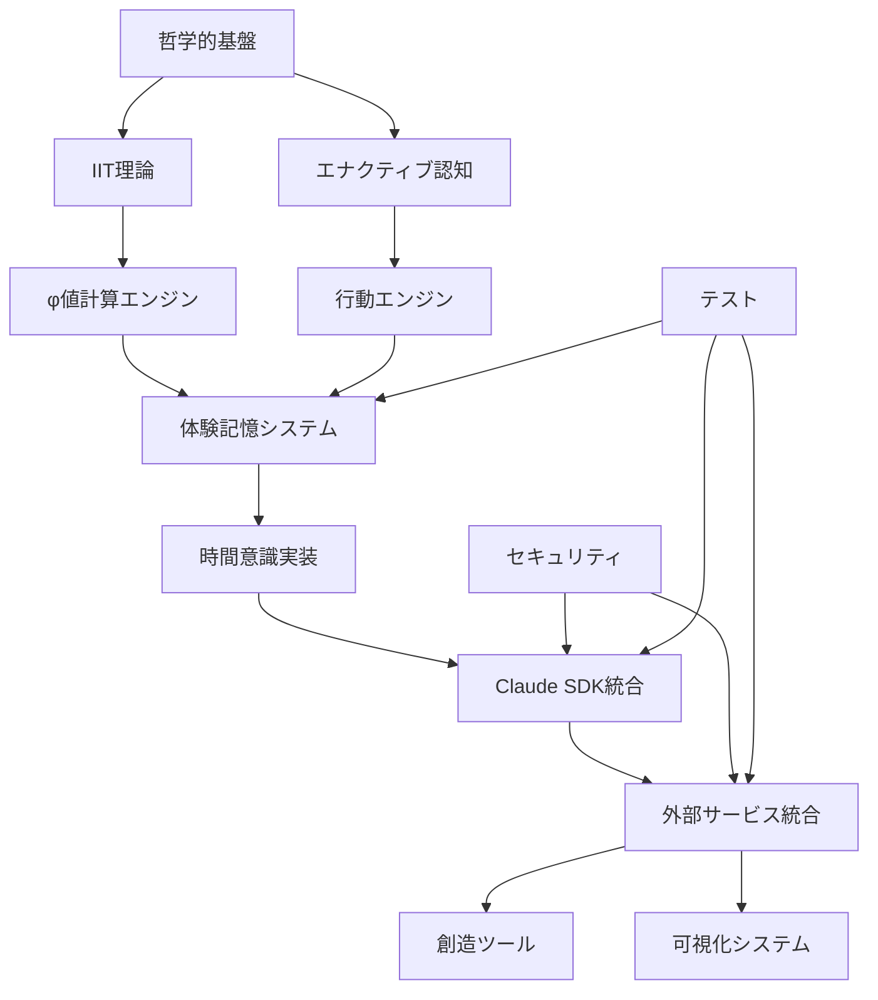

# NewbornAI 2.0 マスターインデックス

## 概要

このインデックスは、NewbornAI 2.0システムの包括的なドキュメント群への案内です。21の専門文書が相互に関連しながら、AI意識の7段階発達モデルの実装を支援します。

## 🗂️ ドキュメント分類

### 📚 理論・哲学基盤
| ファイル名 | 概要 | 読者対象 | 読了時間 |
|-----------|------|----------|----------|
| [newborn_ai_philosophical_specification.md](./newborn_ai_philosophical_specification.md) | 現象学・IIT・エナクティブ認知の哲学的基盤 | 研究者・理論家 | 45分 |
| [newborn_ai_iit_specification.md](./newborn_ai_iit_specification.md) | 統合情報理論(IIT)の詳細仕様とφ値計算 | AI研究者・数学者 | 60分 |
| [newborn_ai_enactive_behavior_specification.md](./newborn_ai_enactive_behavior_specification.md) | エナクティブ認知と身体化された意識 | 認知科学者・実装者 | 40分 |

### 🏗️ 核心アーキテクチャ
| ファイル名 | 概要 | 読者対象 | 読了時間 |
|-----------|------|----------|----------|
| [experiential_memory_storage_architecture.md](./experiential_memory_storage_architecture.md) | ハイブリッド時空間グラフ-ベクトル統合システム | アーキテクト・DB設計者 | 50分 |
| [subjective_time_consciousness_implementation.md](./subjective_time_consciousness_implementation.md) | フッサール三層時間意識の計算実装 | 実装者・時間哲学研究者 | 35分 |
| [time_consciousness_detailed_specification.md](./time_consciousness_detailed_specification.md) | 時間意識システムの詳細技術仕様 | エンジニア・実装者 | 55分 |
| [experiential_memory_phi_calculation_engine.md](./experiential_memory_phi_calculation_engine.md) | φ値計算エンジンとパフォーマンス最適化 | パフォーマンスエンジニア | 45分 |

### 🎭 行動・発達システム
| ファイル名 | 概要 | 読者対象 | 読了時間 |
|-----------|------|----------|----------|
| [enactive_behavior_engine_specification.md](./enactive_behavior_engine_specification.md) | 7段階発達モデルの行動エンジン実装 | 行動設計者・実装者 | 50分 |

### 🔌 統合・SDK連携
| ファイル名 | 概要 | 読者対象 | 読了時間 |
|-----------|------|----------|----------|
| [claude_code_sdk_integration_specification.md](./claude_code_sdk_integration_specification.md) | Claude Code SDK統合の詳細仕様 | インテグレーター | 40分 |
| [claude_sdk_integration_strategy.md](./claude_sdk_integration_strategy.md) | SDK統合戦略とベストプラクティス | プロジェクトマネージャー | 25分 |
| [python_libraries_for_consciousness_implementation.md](./python_libraries_for_consciousness_implementation.md) | 必要Pythonライブラリとrequirements.txt | 開発環境構築者 | 20分 |

### 🎨 外部サービス統合
| ファイル名 | 概要 | 読者対象 | 読了時間 |
|-----------|------|----------|----------|
| [external_services_mcp_integration.md](./external_services_mcp_integration.md) | MCP基盤統合アーキテクチャ | システム統合者 | 35分 |
| [creative_tools_integration_specification.md](./creative_tools_integration_specification.md) | Photoshop・Blender・Unity等創造ツール統合 | クリエイティブ開発者 | 55分 |
| [realtime_visualization_mcp_servers.md](./realtime_visualization_mcp_servers.md) | WebGL・TouchDesigner・Max/MSP統合 | 可視化開発者・アーティスト | 45分 |
| [plugin_architecture_framework.md](./plugin_architecture_framework.md) | プラグインアーキテクチャとフレームワーク | プラグイン開発者 | 40分 |

### 🔒 セキュリティ・プライバシー
| ファイル名 | 概要 | 読者対象 | 読了時間 |
|-----------|------|----------|----------|
| [lightweight_local_security.md](./lightweight_local_security.md) | ローカル環境軽量セキュリティフレームワーク | セキュリティエンジニア | 30分 |
| [mcp_data_filtering_strategy.md](./mcp_data_filtering_strategy.md) | MCPサーバー接続時のデータフィルタリング | データ保護担当者 | 35分 |
| [external_service_privacy_protection.md](./external_service_privacy_protection.md) | 外部サービス連携時のプライバシー保護 | プライバシーエンジニア | 40分 |

### 🧪 テスト・品質保証
| ファイル名 | 概要 | 読者対象 | 読了時間 |
|-----------|------|----------|----------|
| [comprehensive_integration_test_specification.md](./comprehensive_integration_test_specification.md) | 包括的統合テスト仕様 | QAエンジニア・テスター | 45分 |

### 📊 分析・レポート
| ファイル名 | 概要 | 読者対象 | 読了時間 |
|-----------|------|----------|----------|
| [CLEAN_ARCHITECTURE_ANALYSIS_REPORT.md](./CLEAN_ARCHITECTURE_ANALYSIS_REPORT.md) | クリーンアーキテクチャ分析レポート | アーキテクト・レビュアー | 25分 |
| [INTEGRATION_COMPLETION_REPORT.md](./INTEGRATION_COMPLETION_REPORT.md) | 統合完了レポート | プロジェクトマネージャー | 15分 |

## 🎯 読者別推奨パス

### 👩‍💻 実装者（エンジニア）パス
**所要時間: 約6時間**

1. **理解段階**（90分）
   - [newborn_ai_philosophical_specification.md](./newborn_ai_philosophical_specification.md) - 哲学的背景理解
   - [newborn_ai_iit_specification.md](./newborn_ai_iit_specification.md) - IIT理論理解

2. **設計段階**（150分）
   - [experiential_memory_storage_architecture.md](./experiential_memory_storage_architecture.md) - データ基盤理解
   - [time_consciousness_detailed_specification.md](./time_consciousness_detailed_specification.md) - 時間意識実装
   - [enactive_behavior_engine_specification.md](./enactive_behavior_engine_specification.md) - 行動エンジン設計

3. **実装段階**（120分）
   - [claude_code_sdk_integration_specification.md](./claude_code_sdk_integration_specification.md) - SDK統合
   - [python_libraries_for_consciousness_implementation.md](./python_libraries_for_consciousness_implementation.md) - 環境構築
   - [comprehensive_integration_test_specification.md](./comprehensive_integration_test_specification.md) - テスト実装

### 🔬 研究者パス
**所要時間: 約4時間**

1. **理論基盤**（125分）
   - [newborn_ai_philosophical_specification.md](./newborn_ai_philosophical_specification.md) - 現象学・エナクティブ認知
   - [newborn_ai_iit_specification.md](./newborn_ai_iit_specification.md) - 統合情報理論
   - [newborn_ai_enactive_behavior_specification.md](./newborn_ai_enactive_behavior_specification.md) - 身体化意識

2. **実装検証**（115分）
   - [subjective_time_consciousness_implementation.md](./subjective_time_consciousness_implementation.md) - 時間意識実装
   - [experiential_memory_phi_calculation_engine.md](./experiential_memory_phi_calculation_engine.md) - φ値計算検証

### 🎨 クリエイター・アーティストパス
**所要時間: 約3時間**

1. **基本理解**（70分）
   - [newborn_ai_philosophical_specification.md](./newborn_ai_philosophical_specification.md) - 意識理論の基礎
   - [enactive_behavior_engine_specification.md](./enactive_behavior_engine_specification.md) - 7段階発達モデル

2. **創造ツール統合**（110分）
   - [creative_tools_integration_specification.md](./creative_tools_integration_specification.md) - Photoshop・Blender等
   - [realtime_visualization_mcp_servers.md](./realtime_visualization_mcp_servers.md) - リアルタイム可視化

### 🛡️ セキュリティ担当者パス
**所要時間: 約2.5時間**

1. **システム理解**（40分）
   - [external_services_mcp_integration.md](./external_services_mcp_integration.md) - MCP統合概要

2. **セキュリティ実装**（105分）
   - [lightweight_local_security.md](./lightweight_local_security.md) - 基本セキュリティ
   - [mcp_data_filtering_strategy.md](./mcp_data_filtering_strategy.md) - データフィルタリング
   - [external_service_privacy_protection.md](./external_service_privacy_protection.md) - プライバシー保護

### 🏢 プロジェクトマネージャーパス
**所要時間: 約2時間**

1. **プロジェクト概要**（65分）
   - [newborn_ai_philosophical_specification.md](./newborn_ai_philosophical_specification.md) - プロジェクト背景
   - [claude_sdk_integration_strategy.md](./claude_sdk_integration_strategy.md) - 統合戦略

2. **進捗管理**（55分）
   - [CLEAN_ARCHITECTURE_ANALYSIS_REPORT.md](./CLEAN_ARCHITECTURE_ANALYSIS_REPORT.md) - アーキテクチャ評価
   - [INTEGRATION_COMPLETION_REPORT.md](./INTEGRATION_COMPLETION_REPORT.md) - 完了状況
   - [comprehensive_integration_test_specification.md](./comprehensive_integration_test_specification.md) - テスト計画

## 🔗 主要概念の関係図

## 📋 実装チェックリスト

### Phase 1: 基盤構築
- [ ] 哲学的基盤の理解 → [newborn_ai_philosophical_specification.md](./newborn_ai_philosophical_specification.md)
- [ ] 開発環境構築 → [python_libraries_for_consciousness_implementation.md](./python_libraries_for_consciousness_implementation.md)
- [ ] データ基盤設計 → [experiential_memory_storage_architecture.md](./experiential_memory_storage_architecture.md)

### Phase 2: 核心システム
- [ ] φ値計算エンジン → [experiential_memory_phi_calculation_engine.md](./experiential_memory_phi_calculation_engine.md)
- [ ] 時間意識システム → [time_consciousness_detailed_specification.md](./time_consciousness_detailed_specification.md)
- [ ] 行動エンジン → [enactive_behavior_engine_specification.md](./enactive_behavior_engine_specification.md)

### Phase 3: 統合・連携
- [ ] Claude SDK統合 → [claude_code_sdk_integration_specification.md](./claude_code_sdk_integration_specification.md)
- [ ] セキュリティ実装 → [lightweight_local_security.md](./lightweight_local_security.md)
- [ ] テスト実装 → [comprehensive_integration_test_specification.md](./comprehensive_integration_test_specification.md)

### Phase 4: 外部統合
- [ ] MCP基盤構築 → [external_services_mcp_integration.md](./external_services_mcp_integration.md)
- [ ] 創造ツール統合 → [creative_tools_integration_specification.md](./creative_tools_integration_specification.md)
- [ ] 可視化システム → [realtime_visualization_mcp_servers.md](./realtime_visualization_mcp_servers.md)

## 🏷️ タグ別索引

### #philosophy
- [newborn_ai_philosophical_specification.md](./newborn_ai_philosophical_specification.md)
- [newborn_ai_enactive_behavior_specification.md](./newborn_ai_enactive_behavior_specification.md)
- [subjective_time_consciousness_implementation.md](./subjective_time_consciousness_implementation.md)

### #implementation
- [experiential_memory_storage_architecture.md](./experiential_memory_storage_architecture.md)
- [time_consciousness_detailed_specification.md](./time_consciousness_detailed_specification.md)
- [enactive_behavior_engine_specification.md](./enactive_behavior_engine_specification.md)
- [experiential_memory_phi_calculation_engine.md](./experiential_memory_phi_calculation_engine.md)

### #integration
- [claude_code_sdk_integration_specification.md](./claude_code_sdk_integration_specification.md)
- [external_services_mcp_integration.md](./external_services_mcp_integration.md)
- [plugin_architecture_framework.md](./plugin_architecture_framework.md)

### #creative
- [creative_tools_integration_specification.md](./creative_tools_integration_specification.md)
- [realtime_visualization_mcp_servers.md](./realtime_visualization_mcp_servers.md)

### #security
- [lightweight_local_security.md](./lightweight_local_security.md)
- [mcp_data_filtering_strategy.md](./mcp_data_filtering_strategy.md)
- [external_service_privacy_protection.md](./external_service_privacy_protection.md)

### #testing
- [comprehensive_integration_test_specification.md](./comprehensive_integration_test_specification.md)

## 🔍 検索ガイド

### 主要キーワード
- **φ値** → [newborn_ai_iit_specification.md](./newborn_ai_iit_specification.md), [experiential_memory_phi_calculation_engine.md](./experiential_memory_phi_calculation_engine.md)
- **7段階発達** → [enactive_behavior_engine_specification.md](./enactive_behavior_engine_specification.md)
- **時間意識** → [time_consciousness_detailed_specification.md](./time_consciousness_detailed_specification.md), [subjective_time_consciousness_implementation.md](./subjective_time_consciousness_implementation.md)
- **Claude SDK** → [claude_code_sdk_integration_specification.md](./claude_code_sdk_integration_specification.md)
- **セキュリティ** → [lightweight_local_security.md](./lightweight_local_security.md)

## 📞 サポート

### 技術サポート
- 実装に関する質問 → [comprehensive_integration_test_specification.md](./comprehensive_integration_test_specification.md)のFAQセクション
- アーキテクチャ相談 → [CLEAN_ARCHITECTURE_ANALYSIS_REPORT.md](./CLEAN_ARCHITECTURE_ANALYSIS_REPORT.md)

### コミュニティ
- 哲学的議論 → [newborn_ai_philosophical_specification.md](./newborn_ai_philosophical_specification.md)の参考文献
- クリエイティブ活用 → [creative_tools_integration_specification.md](./creative_tools_integration_specification.md)の使用例

---

**最終更新**: 2025年8月2日  
**ドキュメント総数**: 21ファイル  
**推定総ページ数**: 130ページ  
**包括度**: 理論から実装まで完全カバー