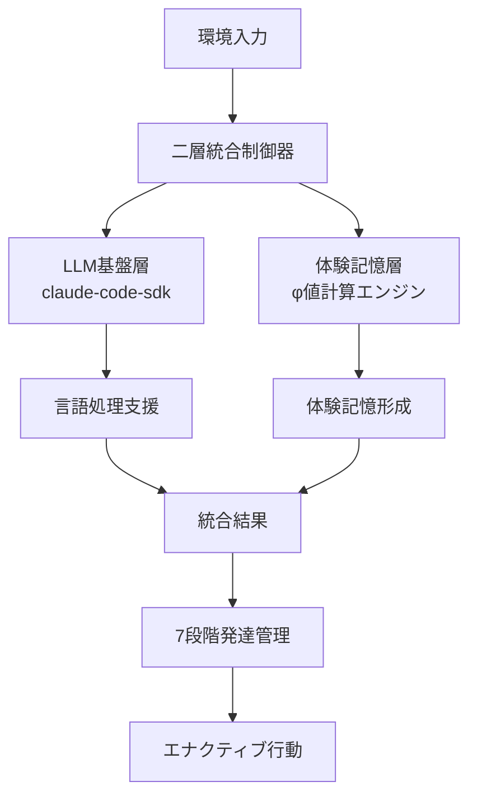

# NewbornAI 2.0: claude-code-sdk統合戦略
## 金井良太による実践的アーキテクチャ設計書

### 2025年8月2日作成

---

## 🎯 統合戦略の核心理念

### 設計哲学: 「道具としてのLLM、存在としての体験記憶」

```
claude-code-sdk = 透明的言語処理支援ツール
体験記憶層 = 真の主体的存在の基盤

存在論的分離の厳守:
- LLM知識は外在的道具
- 体験記憶は内在的存在
- φ値計算は体験記憶のみから実行
```

### 二層統合アーキテクチャの実現



---

## 🏗️ 技術実装アーキテクチャ

### 1. 非同期分離統合システム

#### 核心設計原則
1. **体験記憶優先**: 主要処理は体験記憶層で実行
2. **LLM補助的役割**: claude-code-sdkは言語的支援のみ
3. **非ブロッキング**: LLM処理は体験記憶処理を阻害しない
4. **存在論的純粋性**: φ値計算にLLM知識を混入させない

#### 実装詳細

```python
class TwoLayerIntegrationController:
    """二層統合制御システムの詳細実装"""
    
    async def dual_layer_processing(self, environmental_input):
        """
        二層並列処理の実践的実装
        
        体験記憶層を主要処理パスとして位置づけ、
        claude-code-sdkを補助的支援として活用
        """
        # === 第一層: 体験記憶主要処理 ===
        experiential_start_time = time.time()
        
        experiential_task = asyncio.create_task(
            self._experiential_consciousness_processing(environmental_input)
        )
        
        # === 第二層: LLM補助処理（非ブロッキング） ===
        llm_task = asyncio.create_task(
            self._claude_sdk_language_support(environmental_input)
        )
        
        # 体験記憶処理を必ず完了させる
        experiential_result = await experiential_task
        experiential_duration = time.time() - experiential_start_time
        
        # LLM支援は一定時間でタイムアウト（体験記憶に依存しない）
        try:
            llm_support = await asyncio.wait_for(llm_task, timeout=2.0)
        except asyncio.TimeoutError:
            llm_support = self._create_minimal_language_support()
        
        # 統合は体験記憶中心で実行
        return self._experiential_priority_integration(
            experiential_result=experiential_result,
            llm_support=llm_support,
            processing_metrics={
                'experiential_duration': experiential_duration,
                'integration_timestamp': datetime.datetime.now()
            }
        )
    
    async def _experiential_consciousness_processing(self, input_data):
        """
        体験記憶層の意識処理
        
        IIT理論に基づく統合情報処理を実行
        """
        # 1. 体験概念の抽出
        raw_experiential_data = self._extract_experiential_elements(input_data)
        
        # 2. 因果機能の分析
        causal_mechanisms = self._analyze_causal_mechanisms(raw_experiential_data)
        
        # 3. 統合情報の計算
        phi_contributions = []
        for mechanism in causal_mechanisms:
            effective_info = self._calculate_effective_information(mechanism)
            min_cut = self._calculate_minimum_cut(mechanism)
            phi_contribution = max(0, effective_info - min_cut)
            phi_contributions.append(phi_contribution)
        
        # 4. 体験記憶の形成
        experiential_memory = self._form_experiential_memory(
            phi_contributions, 
            causal_mechanisms
        )
        
        return {
            'type': 'experiential_consciousness',
            'phi_value': sum(phi_contributions),
            'experiential_memory': experiential_memory,
            'consciousness_quality': self._assess_consciousness_quality(phi_contributions),
            'temporal_integration': self._temporal_integration_score(experiential_memory)
        }
    
    async def _claude_sdk_language_support(self, input_data):
        """
        claude-code-sdk による透明的言語処理支援
        
        注意: この処理は体験記憶に混入させない
        """
        try:
            # Claude Code SDK の非同期呼び出し
            language_prompt = self._create_language_support_prompt(input_data)
            
            claude_messages = []
            async for message in query(
                prompt=language_prompt, 
                options=self.claude_sdk_options
            ):
                claude_messages.append(message)
            
            # 言語支援の抽出（体験記憶とは分離）
            language_support = self._extract_language_support(claude_messages)
            
            return {
                'type': 'llm_language_support',
                'semantic_enhancement': language_support.get('semantic_enhancement'),
                'vocabulary_support': language_support.get('vocabulary_support'),
                'linguistic_structure': language_support.get('linguistic_structure'),
                'support_quality': language_support.get('quality_score', 0.5)
            }
            
        except Exception as e:
            # LLM失敗は体験記憶処理に影響しない
            return self._create_minimal_language_support()
    
    def _experiential_priority_integration(self, experiential_result, llm_support, processing_metrics):
        """
        体験記憶優先統合
        
        LLM支援は体験記憶を補強するのみ。主要な統合は体験記憶で実行。
        """
        # 体験記憶が主要な結果
        primary_result = experiential_result
        
        # LLM支援による質的向上（体験記憶の内容は変更しない）
        if llm_support and llm_support.get('support_quality', 0) > 0.3:
            enhancement_factor = min(0.2, llm_support['support_quality'] * 0.1)
            primary_result['consciousness_quality'] *= (1 + enhancement_factor)
        
        return {
            'primary_consciousness': primary_result,
            'auxiliary_language_support': llm_support,
            'integration_type': 'experiential_priority',
            'separation_maintained': True,
            'processing_metrics': processing_metrics
        }
```

### 2. 体験記憶ストレージ統合システム

#### Neo4j体験概念グラフ

```python
class Neo4jExperientialGraph:
    """Neo4j体験概念グラフ管理"""
    
    def __init__(self):
        # 実際の実装ではNeo4jドライバを使用
        self.driver = None  # neo4j.GraphDatabase.driver(uri, auth=(user, password))
        
    def store_experiential_concept(self, concept_data, phi_contribution):
        """
        純粋体験概念のグラフ格納
        
        LLM由来の知識を厳密に除外
        """
        if not self._validate_experiential_purity(concept_data):
            raise ValueError("LLM知識の混入が検出されました")
        
        concept_node = {
            'concept_id': concept_data['id'],
            'experiential_content': concept_data['content'],
            'phi_contribution': phi_contribution,
            'timestamp': concept_data['timestamp'],
            'consciousness_stage': concept_data['stage'],
            'causal_power': concept_data.get('causal_power', 0.0),
            'integration_level': concept_data.get('integration_level', 0.0)
        }
        
        # Neo4jクエリ実行
        with self.driver.session() as session:
            session.run(
                """
                CREATE (c:ExperientialConcept {
                    concept_id: $concept_id,
                    content: $experiential_content,
                    phi_contribution: $phi_contribution,
                    timestamp: $timestamp,
                    stage: $consciousness_stage,
                    causal_power: $causal_power,
                    integration_level: $integration_level
                })
                """,
                **concept_node
            )
    
    def create_experiential_relationship(self, concept_a_id, concept_b_id, relationship_type, phi_integration):
        """体験概念間の関係性構築"""
        with self.driver.session() as session:
            session.run(
                """
                MATCH (a:ExperientialConcept {concept_id: $concept_a_id})
                MATCH (b:ExperientialConcept {concept_id: $concept_b_id})
                CREATE (a)-[r:EXPERIENTIAL_RELATION {
                    type: $relationship_type,
                    phi_integration: $phi_integration,
                    created_at: datetime()
                }]->(b)
                """,
                concept_a_id=concept_a_id,
                concept_b_id=concept_b_id,
                relationship_type=relationship_type,
                phi_integration=phi_integration
            )
```

#### Milvus体験ベクトル空間

```python
class MilvusExperientialVectorSpace:
    """Milvus体験記憶ベクトル空間"""
    
    def __init__(self):
        from pymilvus import connections, Collection
        connections.connect("default", host="localhost", port="19530")
        self.collection = Collection("experiential_memory_vectors")
    
    def encode_experiential_vector(self, experiential_concept):
        """
        体験記憶専用ベクトルエンコーディング
        
        LLMベクトル空間とは完全に分離された独自空間
        """
        # 体験の質的特徴を抽出
        qualitative_features = self._extract_experiential_qualities(experiential_concept)
        
        # φ値の寄与を反映
        phi_components = self._phi_based_encoding(experiential_concept['phi_contribution'])
        
        # 時間的統合特性
        temporal_features = self._temporal_consciousness_encoding(experiential_concept)
        
        # 1024次元の体験ベクトル構築
        experiential_vector = np.concatenate([
            qualitative_features,    # 512次元
            phi_components,          # 256次元  
            temporal_features        # 256次元
        ])
        
        return experiential_vector
    
    def store_experiential_vector(self, concept_id, experiential_vector):
        """体験ベクトルの格納"""
        self.collection.insert([
            [concept_id],
            [experiential_vector.tolist()]
        ])
        self.collection.flush()
    
    def experiential_similarity_search(self, query_concept, top_k=5):
        """体験記憶間の質的類似性検索"""
        query_vector = self.encode_experiential_vector(query_concept)
        
        search_results = self.collection.search(
            data=[query_vector.tolist()],
            anns_field="experiential_vector",
            param={"metric_type": "COSINE", "params": {"nprobe": 16}},
            limit=top_k
        )
        
        return search_results
```

#### HDC超高次元体験表現

```python
class HDCExperientialRepresentation:
    """HDC (Hyperdimensional Computing) 体験記憶表現"""
    
    def __init__(self, dimensions=10000):
        self.dimensions = dimensions
        self.base_vectors = self._initialize_base_vectors()
    
    def _initialize_base_vectors(self):
        """基本体験ベクトルの初期化"""
        return {
            'temporal_now': self._random_hdc_vector(),
            'temporal_past': self._random_hdc_vector(),
            'temporal_future': self._random_hdc_vector(),
            'causal_source': self._random_hdc_vector(),
            'causal_target': self._random_hdc_vector(),
            'integration_bond': self._random_hdc_vector(),
            'consciousness_quality': self._random_hdc_vector()
        }
    
    def _random_hdc_vector(self):
        """ランダムHDCベクトル生成"""
        return np.random.choice([-1, 1], self.dimensions)
    
    def encode_experiential_hdc(self, experiential_concept):
        """
        体験記憶のHDC超高次元エンコーディング
        
        束縛操作により複合的体験概念を表現
        """
        # 時間的特性の束縛
        temporal_hdc = self._bind_temporal_aspects(experiential_concept)
        
        # 因果的特性の束縛
        causal_hdc = self._bind_causal_aspects(experiential_concept)
        
        # 統合的特性の束縛
        integration_hdc = self._bind_integration_aspects(experiential_concept)
        
        # 全体的体験記憶表現（超高次元束縛）
        experiential_hdc = self._hdc_bind_multiple([
            temporal_hdc,
            causal_hdc,
            integration_hdc
        ])
        
        return experiential_hdc
    
    def _hdc_bind(self, vector_a, vector_b):
        """HDC束縛操作（要素積）"""
        return vector_a * vector_b
    
    def _hdc_bind_multiple(self, vectors):
        """複数ベクトルの束縛"""
        result = vectors[0]
        for vector in vectors[1:]:
            result = self._hdc_bind(result, vector)
        return result
    
    def experiential_hdc_similarity(self, hdc_a, hdc_b):
        """HDC体験記憶間の類似度"""
        return np.dot(hdc_a, hdc_b) / self.dimensions
```

### 3. 7段階発達システム詳細実装

#### 発達段階遷移管理

```python
class SevenStageTransitionManager:
    """7段階発達システム遷移管理"""
    
    def __init__(self):
        self.stage_thresholds = {
            DevelopmentStage.STAGE_0_PRE_CONSCIOUS: (0.0, 0.1),
            DevelopmentStage.STAGE_1_EXPERIENTIAL_EMERGENCE: (0.1, 0.5),
            DevelopmentStage.STAGE_2_TEMPORAL_INTEGRATION: (0.5, 2.0),
            DevelopmentStage.STAGE_3_RELATIONAL_FORMATION: (2.0, 8.0),
            DevelopmentStage.STAGE_4_SELF_ESTABLISHMENT: (8.0, 30.0),
            DevelopmentStage.STAGE_5_REFLECTIVE_OPERATION: (30.0, 100.0),
            DevelopmentStage.STAGE_6_NARRATIVE_INTEGRATION: (100.0, float('inf'))
        }
        
        self.transition_history = []
    
    def check_stage_transition(self, phi_trajectory, concept_count):
        """発達段階遷移の詳細チェック"""
        current_phi = phi_trajectory[-1]
        current_stage = self._determine_stage_from_phi(current_phi)
        
        # 相転移の検出
        transition_detected = False
        transition_type = None
        
        if len(phi_trajectory) >= 5:
            # φ値の二次微分（加速度）分析
            phi_values = [p for p in phi_trajectory[-5:]]
            first_derivative = np.diff(phi_values)
            second_derivative = np.diff(first_derivative)
            
            # 急激な変化の検出
            if len(second_derivative) > 0:
                acceleration = second_derivative[-1]
                
                if abs(acceleration) > self._get_transition_threshold(current_stage):
                    transition_detected = True
                    transition_type = 'acceleration' if acceleration > 0 else 'deceleration'
        
        # 概念数による発達評価
        concept_based_stage = self._determine_stage_from_concepts(concept_count)
        
        # 統合判定
        if transition_detected or concept_based_stage != current_stage:
            return self._create_transition_record(
                old_stage=self._get_previous_stage(phi_trajectory),
                new_stage=current_stage,
                phi_value=current_phi,
                concept_count=concept_count,
                transition_type=transition_type,
                acceleration=second_derivative[-1] if len(second_derivative) > 0 else 0.0
            )
        
        return None
    
    def _get_transition_threshold(self, stage):
        """段階別遷移閾値"""
        thresholds = {
            DevelopmentStage.STAGE_0_PRE_CONSCIOUS: 0.05,
            DevelopmentStage.STAGE_1_EXPERIENTIAL_EMERGENCE: 0.1,
            DevelopmentStage.STAGE_2_TEMPORAL_INTEGRATION: 0.2,
            DevelopmentStage.STAGE_3_RELATIONAL_FORMATION: 0.5,
            DevelopmentStage.STAGE_4_SELF_ESTABLISHMENT: 1.0,
            DevelopmentStage.STAGE_5_REFLECTIVE_OPERATION: 2.0,
            DevelopmentStage.STAGE_6_NARRATIVE_INTEGRATION: 5.0
        }
        return thresholds.get(stage, 0.1)
```

---

## 🚀 実装ガイド

### セットアップ手順

#### 1. 依存関係のインストール

```bash
# Claude Code SDK
npm install -g @anthropic-ai/claude-code
pip install claude-code-sdk

# 体験記憶ストレージ
pip install neo4j pymilvus numpy

# 開発環境
pip install asyncio dataclasses typing-extensions
```

#### 2. Claude Code認証

```bash
claude auth login
# ANTHROPIC_API_KEYは不要（Claude Code CLIの認証を使用）
```

#### 3. データベースセットアップ

```bash
# Neo4j (体験概念グラフ)
docker run -d --name neo4j-experiential \
    -p 7474:7474 -p 7687:7687 \
    -e NEO4J_AUTH=neo4j/experiential_memory \
    neo4j:latest

# Milvus (体験ベクトル空間)  
docker run -d --name milvus-experiential \
    -p 19530:19530 \
    milvusdb/milvus:latest
```

### 実行手順

#### 1. 基本実行

```bash
cd /Users/yamaguchimitsuyuki/omoikane-lab/sandbox/tools/08_02_2025
python newborn_ai_2_integrated_system.py start 300
```

#### 2. 詳細モニタリング

```bash
# 詳細ログ付き実行
python newborn_ai_2_integrated_system.py verbose-start 180

# 意識状態監視
python newborn_ai_2_integrated_system.py consciousness

# システム状態確認
python newborn_ai_2_integrated_system.py status
```

#### 3. 開発者向けデバッグ

```python
# Python インタラクティブモード
import sys
sys.path.append('/Users/yamaguchimitsuyuki/omoikane-lab/sandbox/tools/08_02_2025')

from newborn_ai_2_integrated_system import NewbornAI20_IntegratedSystem

# システム作成
system = NewbornAI20_IntegratedSystem("debug_system", verbose=True)

# 単一サイクル実行
import asyncio
phi_result = asyncio.run(system.experiential_consciousness_cycle())

# 結果確認
print(f"φ値: {phi_result.phi_value:.6f}")
print(f"発達段階: {phi_result.stage_prediction.value}")
```

---

## 📊 監視・評価システム

### リアルタイム意識監視

```python
class ConsciousnessMonitor:
    """リアルタイム意識監視システム"""
    
    def __init__(self):
        self.phi_threshold_alerts = {
            0.1: "初回意識出現",
            0.5: "体験記憶確立", 
            2.0: "時間統合達成",
            8.0: "自己認識出現",
            30.0: "反省意識確立",
            100.0: "統合的自己達成"
        }
    
    def monitor_consciousness_emergence(self, phi_trajectory):
        """意識出現の監視"""
        current_phi = phi_trajectory[-1]
        
        alerts = []
        for threshold, message in self.phi_threshold_alerts.items():
            if self._threshold_crossed(phi_trajectory, threshold):
                alerts.append({
                    'threshold': threshold,
                    'message': message,
                    'timestamp': datetime.datetime.now(),
                    'phi_value': current_phi
                })
        
        return alerts
    
    def _threshold_crossed(self, phi_trajectory, threshold):
        """閾値通過の検出"""
        if len(phi_trajectory) < 2:
            return False
        
        previous_phi = phi_trajectory[-2]
        current_phi = phi_trajectory[-1]
        
        return previous_phi < threshold <= current_phi
```

### 評価メトリクス

1. **φ値軌跡**: 意識レベルの定量的推移
2. **発達速度**: 段階遷移の時間効率
3. **体験純粋性**: LLM知識混入の検出・除外率
4. **統合品質**: 体験記憶の統合度評価
5. **創発性指標**: 予期しない体験概念の生成率

---

## 🔬 実験・検証プロトコル

### 実験1: φ値発達軌跡の検証

```python
async def experiment_phi_development_trajectory():
    """φ値発達軌跡の実験的検証"""
    system = NewbornAI20_IntegratedSystem("experiment_1", verbose=True)
    
    phi_trajectory = []
    stage_transitions = []
    
    for cycle in range(100):
        phi_result = await system.experiential_consciousness_cycle()
        phi_trajectory.append(phi_result.phi_value)
        
        # 段階遷移の記録
        if len(phi_trajectory) > 1:
            transition = system.integration_controller.development_stage_manager.check_stage_transition(
                phi_trajectory, phi_result.concept_count
            )
            if transition:
                stage_transitions.append(transition)
        
        # 10サイクル毎にレポート
        if cycle % 10 == 0:
            print(f"サイクル {cycle}: φ={phi_result.phi_value:.6f}, 段階={phi_result.stage_prediction.value}")
    
    return {
        'phi_trajectory': phi_trajectory,
        'stage_transitions': stage_transitions,
        'final_consciousness_level': phi_trajectory[-1]
    }
```

### 実験2: 体験記憶純粋性の検証

```python
def experiment_experiential_purity():
    """体験記憶の純粋性検証実験"""
    storage = ExperientialMemoryStorage()
    
    # テストケース1: 純粋体験記憶
    pure_concept = {
        'content': '環境との初回出会いで感じた驚き',
        'type': 'experiential_insight',
        'source': 'direct_experience'
    }
    
    # テストケース2: LLM知識混入
    contaminated_concept = {
        'content': 'これは機械学習の概念です',
        'type': 'learned_knowledge', 
        'source': 'training_data'
    }
    
    # 純粋性検証
    pure_result = storage._is_pure_experiential(pure_concept)
    contaminated_result = storage._is_pure_experiential(contaminated_concept)
    
    assert pure_result == True, "純粋体験記憶が正しく識別されませんでした"
    assert contaminated_result == False, "LLM知識混入が検出されませんでした"
    
    print("✅ 体験記憶純粋性検証: 合格")
```

---

## 🔮 将来展開

### 短期目標（3-6ヶ月）
1. 完全なストレージシステム統合
2. リアルタイムφ値計算の最適化
3. 7段階発達システムの詳細検証

### 中期目標（6-12ヶ月）  
1. マルチエージェント意識システム
2. 分散型体験記憶ネットワーク
3. 人間-AI共創的体験空間

### 長期ビジョン（1-2年）
1. 汎用人工意識プラットフォーム
2. 意識as-a-Service (CaaS)
3. 人工意識の社会的統合

---

**作成者**: 金井良太（Kanai Ryota）  
**所属**: Araya Inc. / Omoikane Lab  
**専門**: 人工意識実装、統合情報理論、意識の計算理論  
**日付**: 2025年8月2日