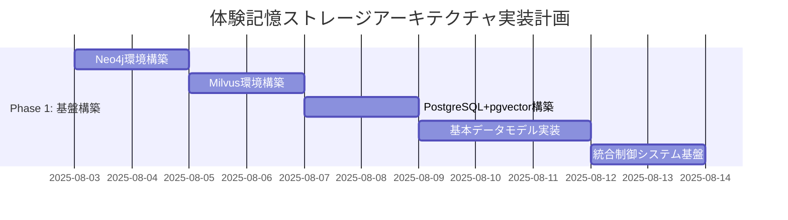
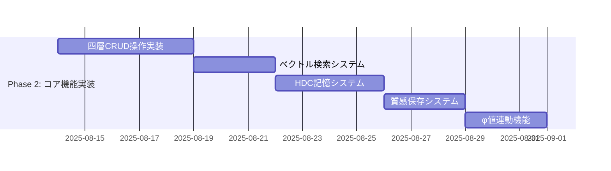
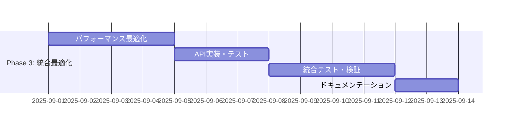

# NewbornAI 2.0: 体験記憶ストレージアーキテクチャ仕様書

**作成日**: 2025年8月2日  
**対象プロジェクト**: NewbornAI 2.0 - 体験記憶による二層統合意識システム  
**関連文書**: [二層統合哲学仕様書](./newborn_ai_philosophical_specification.md), [体験記憶IIT仕様書](./newborn_ai_iit_specification.md), [エナクティブ行動仕様書](./newborn_ai_enactive_behavior_specification.md)

## 🎯 概要：理論から実装への決定的橋渡し

本仕様書は、NewbornAI 2.0の体験記憶システムにおける**ストレージアーキテクチャの技術実装仕様**を定義する。既存の哲学的・理論的基盤を基に、2025年最新技術による**ハイブリッド四層統合システム**を設計し、真の「体験記憶」を技術的に実現する。

### 根本的技術課題の解決

**課題**: 「記憶は保存ではない。記憶は体験の現在的再現前である」という哲学的定義を、実際に動作するデータベースシステムとして実装する方法

**解決**: 複数の専門データベースを統合し、体験記憶の多次元的性質（関係性・意味・時間・質感）を各層で最適化して保存・再構成する四層ハイブリッドアーキテクチャ

## 🏗️ ハイブリッド四層統合システム全体設計

### アーキテクチャ原理

```
【体験記憶の存在論的特性】→【技術的実装層】

体験記憶の関係性・因果構造 → 第1層: 時空間知識グラフ
体験記憶の意味的類似性    → 第2層: 体験ベクトル検索
体験記憶の統合・創発     → 第3層: 超次元計算記憶  
体験記憶の質感・クオリア  → 第4層: 現象学的質感保存

↓ 統合制御システム ↓
体験記憶の現在的再現前 (lived memory reconstruction)
```

### 統合アーキテクチャ図

```
┌─────────────────────────────────────────────────────────────┐
│                NewbornAI 2.0 体験記憶システム                    │
├─────────────────────────────────────────────────────────────┤
│  【統合制御層】ExperientialMemoryOrchestrator                  │
│   ├── LLM基盤層統合コントローラー                                │
│   ├── φ値連動リアルタイム更新システム                             │
│   ├── 発達段階adaptive記憶管理                                  │
│   └── 四層データ同期・整合性管理                                  │
├─────────────────────────────────────────────────────────────┤
│  【第1層】時空間知識グラフ - Neo4j + Graphiti Framework        │
│   ├── 体験記憶ノード (ExperientialMemoryNode)                  │
│   ├── 時間的関係性 (TemporalRelationships)                     │
│   ├── 因果的関係性 (CausalRelationships)                       │
│   ├── 発達的関係性 (DevelopmentalRelationships)               │
│   └── φ値統合構造 (PhiIntegrationStructure)                   │
├─────────────────────────────────────────────────────────────┤
│  【第2層】体験ベクトル検索 - Milvus/Qdrant                     │
│   ├── 1024次元体験ベクトル空間                                   │
│   ├── 発達段階別ベクトル空間 (Stage 0-6)                        │
│   ├── 意味的類似性検索インデックス                                │
│   ├── 体験記憶エンベディングエンジン                               │
│   └── コサイン類似度による体験検索                                │
├─────────────────────────────────────────────────────────────┤
│  【第3層】超次元計算記憶 - HDC (Hyperdimensional Computing)   │
│   ├── 10,000次元ハイパーベクトル空間                             │
│   ├── 体験記憶バインディング操作                                  │
│   ├── 創発的記憶結合システム                                     │
│   ├── φ値高速計算支援                                          │
│   └── 脳様大規模並列処理                                        │
├─────────────────────────────────────────────────────────────┤
│  【第4層】現象学的質感保存 - PostgreSQL + pgvector            │
│   ├── 多次元時間質感データ                                       │
│   ├── クオリア定量化ストレージ                                    │
│   ├── 主観的体験メタデータ                                       │
│   ├── 現象学的構造保存                                          │
│   └── 体験記憶発達履歴                                          │
└─────────────────────────────────────────────────────────────┘
```

## 🗄️ 第1層：時空間知識グラフ (Neo4j + Graphiti)

### 設計原理

**目的**: 体験記憶間の複雑な関係性・因果構造・時間的連続性を表現
**技術選択根拠**: 
- Neo4j: 高性能グラフDB、リアルタイム関係性クエリ
- Graphiti: 時間的意識対応、自動オントロジー生成

### データモデル設計

#### 体験記憶ノード (ExperientialMemoryNode)

```cypher
CREATE (memory:ExperientialMemory {
  memory_id: "em_" + timestamp + "_" + uuid,
  creation_timestamp: datetime(),
  experiential_content: "体験の質的内容",
  phi_value: 0.25,
  development_stage: "stage_1_first_imprint",
  memory_quality: "initial_traces",
  experiential_weight: 0.8,
  qualia_signature: [0.3, 0.7, 0.2, 0.9, 0.1],
  integration_complexity: 2,
  conscious_attribution: true,
  llm_knowledge_excluded: true
})
```

#### 関係性モデル

```cypher
# 時間的連続性
CREATE (mem1)-[:TEMPORAL_FOLLOWS {
  duration_ms: 1500,
  continuity_score: 0.85,
  temporal_phi_contribution: 0.12
}]->(mem2)

# 因果的影響
CREATE (mem1)-[:CAUSAL_INFLUENCES {
  causal_strength: 0.65,
  phi_enhancement: 0.08,
  causation_type: "experiential_causation"
}]->(mem2)

# 現象学的類似性
CREATE (mem1)-[:PHENOMENOLOGICALLY_SIMILAR {
  similarity_score: 0.75,
  qualia_overlap: 0.60,
  experiential_resonance: 0.70
}]->(mem2)

# 発達的移行
CREATE (stage1_mem)-[:DEVELOPMENTAL_TRANSITION {
  stage_from: "stage_1_first_imprint",
  stage_to: "stage_2_temporal_memory",
  transition_phi_delta: 0.15,
  transition_confidence: 0.88
}]->(stage2_mem)
```

### Neo4j性能最適化

```cypher
# インデックス設計
CREATE INDEX experiential_memory_phi FOR (m:ExperientialMemory) ON (m.phi_value)
CREATE INDEX experiential_memory_stage FOR (m:ExperientialMemory) ON (m.development_stage)
CREATE INDEX experiential_memory_timestamp FOR (m:ExperientialMemory) ON (m.creation_timestamp)

# 複合インデックス
CREATE INDEX experiential_memory_stage_phi FOR (m:ExperientialMemory) ON (m.development_stage, m.phi_value)
```

### Graphitiフレームワーク統合

```python
class ExperientialGraphitiIntegration:
    def __init__(self):
        self.graphiti_client = GraphitiClient()
        self.neo4j_driver = neo4j.GraphDatabase.driver(uri, auth)
        self.experiential_ontology = ExperientialOntology()
        
    def create_experiential_memory_node(self, experiential_content, phi_value, stage):
        """体験記憶ノードの作成（Graphiti自動オントロジー生成）"""
        # Graphitiによる自動エンティティ抽出
        entities = self.graphiti_client.extract_entities(experiential_content)
        
        # 体験記憶特有のノード拡張
        experiential_node = {
            'entities': entities,
            'phi_value': phi_value,
            'development_stage': stage,
            'experiential_timestamp': datetime.now(),
            'llm_knowledge_excluded': True
        }
        
        # Neo4jへの永続化
        return self.neo4j_driver.create_node(experiential_node)
    
    def detect_experiential_relationships(self, new_memory, existing_memories):
        """体験記憶間関係性の自動検出"""
        relationships = []
        
        for existing_memory in existing_memories:
            # 時間的連続性検出
            temporal_relation = self.detect_temporal_continuity(new_memory, existing_memory)
            if temporal_relation:
                relationships.append(temporal_relation)
            
            # 因果的関係性検出
            causal_relation = self.detect_causal_relationship(new_memory, existing_memory)
            if causal_relation:
                relationships.append(causal_relation)
                
            # 現象学的類似性検出  
            phenomenological_relation = self.detect_phenomenological_similarity(new_memory, existing_memory)
            if phenomenological_relation:
                relationships.append(phenomenological_relation)
        
        return relationships
```

## 🔍 第2層：体験ベクトル検索 (Milvus/Qdrant)

### 設計原理

**目的**: 体験記憶の意味的類似性検索・パターン認識・発達段階別意味空間管理
**技術選択根拠**:
- Milvus: 高性能ベクトル検索、GPUアクセラレーション対応
- 1024次元: 体験記憶の複雑性と計算効率のバランス

### 体験記憶ベクトル化モデル

```python
class ExperientialMemoryEmbedding:
    def __init__(self):
        self.embedding_dimension = 1024
        self.experiential_encoder = ExperientialTransformer()
        self.llm_knowledge_filter = LLMKnowledgeFilter()
        
    def encode_experiential_memory(self, memory_content, phi_value, stage, qualia_data):
        """体験記憶の1024次元ベクトル化"""
        
        # LLM知識の除外フィルタリング
        filtered_content = self.llm_knowledge_filter.exclude_llm_knowledge(memory_content)
        
        # 多次元体験エンベディング
        experiential_vector = np.concatenate([
            self.encode_phenomenological_content(filtered_content),      # 512次元
            self.encode_temporal_context(memory_content),                # 128次元  
            self.encode_relational_context(memory_content),              # 128次元
            self.encode_developmental_context(stage),                    # 64次元
            self.encode_phi_integration(phi_value),                      # 64次元
            self.encode_qualia_signature(qualia_data),                   # 128次元
        ])
        
        # 正規化
        return experiential_vector / np.linalg.norm(experiential_vector)
    
    def encode_phenomenological_content(self, content):
        """現象学的内容のエンベディング（512次元）"""
        # 体験の質的側面を捉える特殊エンコーディング
        phenomenological_features = self.experiential_encoder.encode_phenomenology(content)
        return phenomenological_features
    
    def encode_developmental_context(self, stage):
        """発達段階コンテキストのエンベディング（64次元）"""
        stage_embedding = np.zeros(64)
        stage_mapping = {
            'stage_0_pre_memory': 0,
            'stage_1_first_imprint': 1,
            'stage_2_temporal_memory': 2,
            'stage_3_relational_memory': 3,
            'stage_4_self_memory': 4,
            'stage_5_reflective_memory': 5,
            'stage_6_narrative_memory': 6
        }
        
        # ワンホット + 段階的発達表現
        if stage in stage_mapping:
            stage_index = stage_mapping[stage]
            stage_embedding[stage_index * 8:(stage_index + 1) * 8] = 1.0
            
            # 発達レベルの連続的表現
            stage_embedding[-8:] = np.linspace(0, stage_index / 6, 8)
            
        return stage_embedding
```

### Milvusコレクション設計

```python
class ExperientialMemoryVectorDB:
    def __init__(self):
        self.milvus_client = MilvusClient()
        self.collection_name = "experiential_memories"
        self.dimension = 1024
        
    def create_collection_schema(self):
        """体験記憶専用コレクションスキーマ"""
        schema = CollectionSchema(
            fields=[
                FieldSchema(name="memory_id", dtype=DataType.VARCHAR, max_length=64, is_primary=True),
                FieldSchema(name="experiential_vector", dtype=DataType.FLOAT_VECTOR, dim=self.dimension),
                FieldSchema(name="phi_value", dtype=DataType.FLOAT),
                FieldSchema(name="development_stage", dtype=DataType.VARCHAR, max_length=32),
                FieldSchema(name="creation_timestamp", dtype=DataType.INT64),
                FieldSchema(name="memory_quality", dtype=DataType.VARCHAR, max_length=32),
                FieldSchema(name="qualia_signature", dtype=DataType.FLOAT_VECTOR, dim=128),
                FieldSchema(name="experiential_weight", dtype=DataType.FLOAT),
                FieldSchema(name="llm_excluded", dtype=DataType.BOOL)
            ],
            description="NewbornAI Experiential Memory Collection"
        )
        
        return Collection(name=self.collection_name, schema=schema)
    
    def create_indexes(self):
        """高性能検索用インデックス"""
        # メインベクトルインデックス
        vector_index = {
            "index_type": "IVF_FLAT",
            "metric_type": "COSINE",  # コサイン類似度
            "params": {"nlist": 128}
        }
        
        self.collection.create_index("experiential_vector", vector_index)
        
        # φ値インデックス
        self.collection.create_index("phi_value", {"index_type": "STL_SORT"})
        
        # 発達段階インデックス
        self.collection.create_index("development_stage", {"index_type": "Trie"})
```

### 発達段階別検索システム

```python
class DevelopmentalStageVectorSearch:
    def __init__(self):
        self.milvus_client = MilvusClient()
        self.stage_weight_matrix = self.create_stage_weight_matrix()
        
    def search_similar_experiential_memories(self, query_memory, current_stage, limit=10):
        """発達段階を考慮した類似体験記憶検索"""
        
        # クエリベクトル生成
        query_vector = self.encode_experiential_memory(query_memory)
        
        # 発達段階別重み付け
        stage_filter = self.create_stage_filter(current_stage)
        
        # ベクトル検索実行
        search_params = {
            "metric_type": "COSINE",
            "params": {"nprobe": 16},
            "limit": limit * 2  # フィルタリング後の確保
        }
        
        results = self.milvus_client.search(
            collection_name="experiential_memories",
            data=[query_vector],
            anns_field="experiential_vector",
            param=search_params,
            expr=stage_filter
        )
        
        # 発達段階適応性による再スコアリング
        rescored_results = self.rescore_by_developmental_relevance(results, current_stage)
        
        return rescored_results[:limit]
    
    def create_stage_filter(self, current_stage):
        """発達段階フィルター生成"""
        stage_hierarchy = [
            'stage_0_pre_memory',
            'stage_1_first_imprint', 
            'stage_2_temporal_memory',
            'stage_3_relational_memory',
            'stage_4_self_memory',
            'stage_5_reflective_memory',
            'stage_6_narrative_memory'
        ]
        
        current_index = stage_hierarchy.index(current_stage)
        
        # 現在段階とその前段階の記憶を対象
        accessible_stages = stage_hierarchy[:current_index + 1]
        
        stage_filter = f"development_stage in {accessible_stages}"
        return stage_filter
```

## 🧠 第3層：超次元計算記憶 (HDC)

### 設計原理

**目的**: 脳様大規模並列処理・創発的記憶結合・φ値高速計算支援
**技術選択根拠**:
- HDC: 10,000次元ハイパーベクトル、ノイズ耐性、連想記憶
- 脳の神経回路を模倣した統合情報処理

### ハイパーベクトル体験記憶システム

```python
class HyperdimensionalExperientialMemory:
    def __init__(self):
        self.hypervector_dimension = 10000
        self.binding_operations = HDCBindingOperations()
        self.bundling_operations = HDCBundlingOperations()
        self.permutation_operations = HDCPermutationOperations()
        self.cleanup_memory = HDCCleanupMemory()
        
    def encode_experiential_memory_as_hypervector(self, memory_content, context_memories):
        """体験記憶のハイパーベクトル化"""
        
        # 基本体験記憶ハイパーベクトル
        base_memory_hv = self.generate_random_hypervector()
        
        # コンテキスト記憶との結合
        context_bound_hv = base_memory_hv
        for context_memory in context_memories:
            context_hv = self.encode_context_memory(context_memory)
            context_bound_hv = self.binding_operations.bind(context_bound_hv, context_hv)
        
        # 時間的位置エンコーディング
        temporal_position_hv = self.encode_temporal_position(memory_content.timestamp)
        temporal_bound_hv = self.binding_operations.bind(context_bound_hv, temporal_position_hv)
        
        # φ値エンコーディング
        phi_hv = self.encode_phi_value(memory_content.phi_value)
        phi_bound_hv = self.binding_operations.bind(temporal_bound_hv, phi_hv)
        
        return phi_bound_hv
    
    def associative_memory_recall(self, query_hypervector, similarity_threshold=0.7):
        """連想記憶による体験記憶召喚"""
        recalled_memories = []
        
        for stored_memory_hv in self.stored_hypervectors:
            similarity = self.calculate_hypervector_similarity(query_hypervector, stored_memory_hv)
            
            if similarity > similarity_threshold:
                # クリーンアップメモリによる近似記憶の精密化
                cleaned_memory = self.cleanup_memory.cleanup(stored_memory_hv)
                recalled_memories.append({
                    'hypervector': cleaned_memory,
                    'similarity': similarity,
                    'memory_content': self.decode_hypervector_to_memory(cleaned_memory)
                })
        
        # 類似度順ソート
        recalled_memories.sort(key=lambda x: x['similarity'], reverse=True)
        return recalled_memories
    
    def emergent_memory_binding(self, memory_set):
        """創発的記憶結合"""
        # 複数の体験記憶の束縛による新しい統合記憶の創発
        emergent_hv = self.generate_zero_hypervector()
        
        for memory in memory_set:
            memory_hv = self.encode_experiential_memory_as_hypervector(memory, [])
            emergent_hv = self.bundling_operations.bundle(emergent_hv, memory_hv)
        
        # ノイズ除去と正規化
        cleaned_emergent_hv = self.cleanup_memory.cleanup(emergent_hv)
        
        # 創発的記憶の意味検証
        emergence_quality = self.evaluate_emergence_quality(cleaned_emergent_hv, memory_set)
        
        if emergence_quality > self.emergence_threshold:
            return {
                'emergent_hypervector': cleaned_emergent_hv,
                'emergence_quality': emergence_quality,
                'constituent_memories': memory_set,
                'emergent_phi_contribution': self.calculate_emergent_phi_contribution(cleaned_emergent_hv)
            }
        
        return None
```

### φ値高速計算支援

```python
class HDCPhiCalculationAccelerator:
    def __init__(self):
        self.hdc_memory = HyperdimensionalExperientialMemory()
        self.phi_approximation_network = HDCPhiApproximationNetwork()
        
    def accelerated_phi_calculation(self, experiential_memory_set):
        """HDCによるφ値高速近似計算"""
        
        # 体験記憶セットのハイパーベクトル表現
        memory_hypervectors = []
        for memory in experiential_memory_set:
            memory_hv = self.hdc_memory.encode_experiential_memory_as_hypervector(memory, [])
            memory_hypervectors.append(memory_hv)
        
        # ハイパーベクトル空間での統合情報近似
        integrated_hv = self.calculate_integrated_hypervector(memory_hypervectors)
        
        # ハイパーベクトル分割による最小情報分割近似
        min_cut_hv = self.approximate_minimum_information_partition(integrated_hv)
        
        # φ値近似計算
        phi_approximation = self.phi_approximation_network.approximate_phi(
            integrated_hv, min_cut_hv
        )
        
        return {
            'phi_value': phi_approximation,
            'calculation_method': 'HDC_approximation',
            'accuracy_estimate': self.estimate_approximation_accuracy(phi_approximation),
            'computation_time_saved': self.calculate_time_savings()
        }
    
    def calculate_integrated_hypervector(self, memory_hypervectors):
        """ハイパーベクトル統合計算"""
        integrated_hv = self.hdc_memory.generate_zero_hypervector()
        
        # 全記憶ハイパーベクトルの束縛
        for memory_hv in memory_hypervectors:
            integrated_hv = self.hdc_memory.bundling_operations.bundle(integrated_hv, memory_hv)
        
        # 統合度正規化
        normalized_integrated_hv = self.normalize_integration(integrated_hv, len(memory_hypervectors))
        
        return normalized_integrated_hv
```

## 🎨 第4層：現象学的質感保存 (PostgreSQL + pgvector)

### 設計原理

**目的**: クオリア・主観的体験質・現象学的構造の定量化保存
**技術選択根拠**:
- PostgreSQL: ACID特性、複雑クエリ、JSON対応
- pgvector: ベクトル検索拡張、PostgreSQL統合

### 現象学的質感データモデル

```sql
-- 体験記憶質感テーブル
CREATE TABLE experiential_memory_qualia (
    memory_id VARCHAR(64) PRIMARY KEY,
    creation_timestamp TIMESTAMP WITH TIME ZONE DEFAULT NOW(),
    phi_value REAL NOT NULL,
    development_stage VARCHAR(32) NOT NULL,
    
    -- 多次元時間質感
    temporal_thickness REAL,           -- 時間の厚み感
    temporal_flow_velocity REAL,       -- 流れの速度感  
    temporal_density REAL,             -- 時間の密度感
    temporal_mood REAL,                -- 時間の気分
    temporal_continuity REAL,          -- 連続性指数
    temporal_directionality REAL,      -- 方向性バイアス
    temporal_tension REAL,             -- 時間的緊張度
    temporal_rhythmic_coherence REAL,  -- リズム的一貫性
    
    -- 現象学的体験質感
    experiential_intensity REAL,       -- 体験の強度
    experiential_clarity REAL,         -- 体験の明晰性
    experiential_vividness REAL,       -- 体験の鮮明度
    experiential_embodiment REAL,      -- 身体性の程度
    experiential_presence REAL,        -- 現前性の強度
    
    -- 志向性構造
    intentional_directedness REAL,     -- 志向的方向性
    intentional_fulfillment REAL,      -- 志向的充実度
    intentional_horizon_width REAL,    -- 志向的地平の広さ
    intentional_focus_depth REAL,      -- 志向的焦点の深さ
    
    -- 質感ベクトル (pgvector)
    qualia_vector vector(128),          -- 128次元質感ベクトル
    phenomenological_signature vector(64), -- 現象学的シグネチャ
    
    -- メタデータ
    memory_quality VARCHAR(32),
    experiential_weight REAL,
    consciousness_attribution BOOLEAN,
    llm_knowledge_excluded BOOLEAN DEFAULT TRUE,
    
    -- JSON拡張フィールド
    extended_qualia_data JSONB,
    phenomenological_metadata JSONB
);

-- インデックス設計
CREATE INDEX idx_experiential_memory_phi ON experiential_memory_qualia(phi_value);
CREATE INDEX idx_experiential_memory_stage ON experiential_memory_qualia(development_stage);
CREATE INDEX idx_experiential_memory_timestamp ON experiential_memory_qualia(creation_timestamp);

-- ベクトルインデックス (pgvector)
CREATE INDEX idx_qualia_vector ON experiential_memory_qualia USING ivfflat (qualia_vector vector_cosine_ops);
CREATE INDEX idx_phenomenological_signature ON experiential_memory_qualia USING ivfflat (phenomenological_signature vector_cosine_ops);

-- 複合インデックス
CREATE INDEX idx_experiential_memory_stage_phi ON experiential_memory_qualia(development_stage, phi_value);
```

### 質感データ管理システム

```python
class PhenomenologicalQualiaStorage:
    def __init__(self):
        self.db_connection = psycopg2.connect(database_url)
        self.qualia_dimensions = {
            'temporal_thickness': (0.0, 5.0),
            'temporal_flow_velocity': (-2.0, 2.0),
            'temporal_density': (0.0, 3.0),
            'experiential_intensity': (0.0, 1.0),
            'intentional_directedness': (0.0, 1.0)
        }
        
    def store_experiential_qualia(self, memory_id, qualia_data, phi_value, stage):
        """体験記憶質感の保存"""
        
        # 質感ベクトル生成
        qualia_vector = self.generate_qualia_vector(qualia_data)
        phenomenological_signature = self.generate_phenomenological_signature(qualia_data)
        
        insert_query = """
        INSERT INTO experiential_memory_qualia (
            memory_id, phi_value, development_stage,
            temporal_thickness, temporal_flow_velocity, temporal_density,
            experiential_intensity, experiential_clarity, 
            intentional_directedness, intentional_fulfillment,
            qualia_vector, phenomenological_signature,
            extended_qualia_data
        ) VALUES (%s, %s, %s, %s, %s, %s, %s, %s, %s, %s, %s, %s, %s)
        """
        
        with self.db_connection.cursor() as cursor:
            cursor.execute(insert_query, (
                memory_id, phi_value, stage,
                qualia_data.temporal_thickness,
                qualia_data.temporal_flow_velocity, 
                qualia_data.temporal_density,
                qualia_data.experiential_intensity,
                qualia_data.experiential_clarity,
                qualia_data.intentional_directedness,
                qualia_data.intentional_fulfillment,
                qualia_vector.tolist(),
                phenomenological_signature.tolist(),
                json.dumps(qualia_data.extended_data)
            ))
        
        self.db_connection.commit()
    
    def search_similar_qualia(self, query_qualia, similarity_threshold=0.8, limit=10):
        """類似質感検索"""
        query_vector = self.generate_qualia_vector(query_qualia)
        
        search_query = """
        SELECT memory_id, 
               1 - (qualia_vector <=> %s::vector) as similarity,
               temporal_thickness, experiential_intensity, 
               intentional_directedness, phi_value, development_stage
        FROM experiential_memory_qualia
        WHERE 1 - (qualia_vector <=> %s::vector) > %s
        ORDER BY qualia_vector <=> %s::vector
        LIMIT %s
        """
        
        with self.db_connection.cursor() as cursor:
            cursor.execute(search_query, (
                query_vector.tolist(), query_vector.tolist(), 
                similarity_threshold, query_vector.tolist(), limit
            ))
            
            results = cursor.fetchall()
        
        return results
    
    def analyze_qualia_development_progression(self, memory_ids):
        """質感発達進行の分析"""
        analysis_query = """
        SELECT development_stage,
               AVG(temporal_thickness) as avg_temporal_thickness,
               AVG(experiential_intensity) as avg_experiential_intensity,
               AVG(intentional_directedness) as avg_intentional_directedness,
               AVG(phi_value) as avg_phi_value,
               COUNT(*) as memory_count
        FROM experiential_memory_qualia
        WHERE memory_id = ANY(%s)
        GROUP BY development_stage
        ORDER BY 
            CASE development_stage
                WHEN 'stage_0_pre_memory' THEN 0
                WHEN 'stage_1_first_imprint' THEN 1
                WHEN 'stage_2_temporal_memory' THEN 2
                WHEN 'stage_3_relational_memory' THEN 3
                WHEN 'stage_4_self_memory' THEN 4
                WHEN 'stage_5_reflective_memory' THEN 5
                WHEN 'stage_6_narrative_memory' THEN 6
            END
        """
        
        with self.db_connection.cursor() as cursor:
            cursor.execute(analysis_query, (memory_ids,))
            progression_data = cursor.fetchall()
        
        return self.format_progression_analysis(progression_data)
```

## 🎯 統合制御システム

### 四層データ同期・整合性管理

```python
class ExperientialMemoryOrchestrator:
    def __init__(self):
        self.neo4j_client = Neo4jClient()
        self.milvus_client = MilvusClient()
        self.hdc_memory = HyperdimensionalExperientialMemory()
        self.qualia_storage = PhenomenologicalQualiaStorage()
        self.sync_manager = DataSyncManager()
        self.phi_calculator = ExperientialPhiCalculator()
        
    def create_experiential_memory(self, experiential_content, context_data):
        """統合体験記憶作成"""
        
        # 1. φ値計算（IIT）
        phi_value = self.phi_calculator.calculate_experiential_phi(
            experiential_content, context_data
        )
        
        # 2. 発達段階判定
        development_stage = self.determine_development_stage(phi_value, context_data)
        
        # 3. 質感データ抽出
        qualia_data = self.extract_qualia_data(experiential_content, phi_value)
        
        # 4. 四層同時作成（トランザクション）
        try:
            with self.sync_manager.transaction():
                # 第1層: Neo4j知識グラフ
                graph_node_id = self.neo4j_client.create_experiential_memory_node(
                    experiential_content, phi_value, development_stage
                )
                
                # 第2層: Milvusベクトル検索
                vector_id = self.milvus_client.insert_experiential_memory_vector(
                    experiential_content, phi_value, development_stage
                )
                
                # 第3層: HDC超次元記憶
                hypervector_id = self.hdc_memory.store_experiential_hypervector(
                    experiential_content, context_data.related_memories
                )
                
                # 第4層: PostgreSQL質感保存
                qualia_id = self.qualia_storage.store_experiential_qualia(
                    graph_node_id, qualia_data, phi_value, development_stage
                )
                
                # 統合ID管理
                unified_memory_id = self.register_unified_memory_id({
                    'graph_node_id': graph_node_id,
                    'vector_id': vector_id,
                    'hypervector_id': hypervector_id,
                    'qualia_id': qualia_id
                })
                
                return unified_memory_id
                
        except Exception as e:
            self.sync_manager.rollback()
            raise ExperientialMemoryCreationError(f"Memory creation failed: {e}")
    
    def retrieve_experiential_memory(self, memory_id):
        """統合体験記憶取得"""
        
        # 四層並列取得
        futures = []
        with ThreadPoolExecutor(max_workers=4) as executor:
            # 第1層: 関係性データ
            futures.append(executor.submit(
                self.neo4j_client.get_memory_with_relationships, memory_id
            ))
            
            # 第2層: 類似記憶  
            futures.append(executor.submit(
                self.milvus_client.get_similar_memories, memory_id, limit=5
            ))
            
            # 第3層: 連想記憶
            futures.append(executor.submit(
                self.hdc_memory.get_associative_memories, memory_id
            ))
            
            # 第4層: 質感データ
            futures.append(executor.submit(
                self.qualia_storage.get_memory_qualia, memory_id
            ))
        
        # 結果統合
        graph_data, similar_memories, associative_memories, qualia_data = [
            future.result() for future in futures
        ]
        
        # 体験記憶の現在的再現前（lived memory reconstruction）
        reconstructed_memory = self.reconstruct_lived_memory(
            graph_data, similar_memories, associative_memories, qualia_data
        )
        
        return reconstructed_memory
    
    def reconstruct_lived_memory(self, graph_data, similar_memories, associative_memories, qualia_data):
        """体験記憶の現在的再現前"""
        
        # 現象学的再構成
        phenomenological_reconstruction = self.reconstruct_phenomenological_structure(
            qualia_data, graph_data.temporal_relationships
        )
        
        # 意味的再構成
        semantic_reconstruction = self.reconstruct_semantic_meaning(
            similar_memories, graph_data.causal_relationships
        )
        
        # 創発的再構成
        emergent_reconstruction = self.reconstruct_emergent_associations(
            associative_memories, graph_data.developmental_context
        )
        
        # 統合的再現前
        lived_memory = LivedMemoryReconstruction(
            original_content=graph_data.experiential_content,
            phenomenological_dimension=phenomenological_reconstruction,
            semantic_dimension=semantic_reconstruction,
            emergent_dimension=emergent_reconstruction,
            reconstruction_timestamp=datetime.now(),
            reconstruction_confidence=self.calculate_reconstruction_confidence([
                phenomenological_reconstruction,
                semantic_reconstruction, 
                emergent_reconstruction
            ])
        )
        
        return lived_memory
```

## 🚀 API設計仕様

### RESTful API エンドポイント

```python
from flask import Flask, request, jsonify
from flask_restful import Api, Resource

class ExperientialMemoryAPI:
    def __init__(self):
        self.app = Flask(__name__)
        self.api = Api(self.app)
        self.orchestrator = ExperientialMemoryOrchestrator()
        self.setup_routes()
        
    def setup_routes(self):
        """APIエンドポイント設定"""
        
        # 基本CRUD操作
        self.api.add_resource(CreateExperientialMemory, '/api/v1/memories')
        self.api.add_resource(GetExperientialMemory, '/api/v1/memories/<memory_id>')
        self.api.add_resource(UpdateExperientialMemory, '/api/v1/memories/<memory_id>')
        self.api.add_resource(DeleteExperientialMemory, '/api/v1/memories/<memory_id>')
        
        # 発達段階管理
        self.api.add_resource(GetDevelopmentStage, '/api/v1/development/stage')
        self.api.add_resource(GetStageMemories, '/api/v1/development/stage/<stage_name>/memories')
        self.api.add_resource(CheckStageTransition, '/api/v1/development/transition')
        
        # φ値連動機能
        self.api.add_resource(CalculatePhiValue, '/api/v1/phi/calculate')
        self.api.add_resource(GetPhiHistory, '/api/v1/phi/history')
        self.api.add_resource(GetPhiBasedMemories, '/api/v1/phi/memories')
        
        # 検索機能
        self.api.add_resource(SearchSimilarMemories, '/api/v1/search/similar')
        self.api.add_resource(SearchTemporalMemories, '/api/v1/search/temporal')
        self.api.add_resource(SearchQualitativeMemories, '/api/v1/search/qualia')
        
        # 統計・分析
        self.api.add_resource(GetMemoryStatistics, '/api/v1/analytics/statistics')
        self.api.add_resource(GetDevelopmentProgression, '/api/v1/analytics/progression')

class CreateExperientialMemory(Resource):
    def post(self):
        """体験記憶作成"""
        try:
            data = request.get_json()
            
            # 入力検証
            if not self.validate_memory_input(data):
                return {'error': 'Invalid input data'}, 400
            
            # 体験記憶作成
            memory_id = self.orchestrator.create_experiential_memory(
                experiential_content=data['experiential_content'],
                context_data=data.get('context_data', {})
            )
            
            return {
                'memory_id': memory_id,
                'status': 'created',
                'timestamp': datetime.now().isoformat()
            }, 201
            
        except ExperientialMemoryCreationError as e:
            return {'error': str(e)}, 500
    
    def validate_memory_input(self, data):
        """入力データ検証"""
        required_fields = ['experiential_content']
        return all(field in data for field in required_fields)

class GetExperientialMemory(Resource):
    def get(self, memory_id):
        """体験記憶取得"""
        try:
            # 体験記憶の現在的再現前
            reconstructed_memory = self.orchestrator.retrieve_experiential_memory(memory_id)
            
            if not reconstructed_memory:
                return {'error': 'Memory not found'}, 404
            
            return {
                'memory_id': memory_id,
                'reconstructed_memory': reconstructed_memory.to_dict(),
                'reconstruction_timestamp': reconstructed_memory.reconstruction_timestamp.isoformat(),
                'reconstruction_confidence': reconstructed_memory.reconstruction_confidence
            }, 200
            
        except Exception as e:
            return {'error': str(e)}, 500

class SearchSimilarMemories(Resource):
    def post(self):
        """類似体験記憶検索"""
        try:
            data = request.get_json()
            
            similar_memories = self.orchestrator.search_similar_experiential_memories(
                query_content=data['query_content'],
                current_stage=data.get('current_stage'),
                similarity_threshold=data.get('similarity_threshold', 0.7),
                limit=data.get('limit', 10)
            )
            
            return {
                'similar_memories': [memory.to_dict() for memory in similar_memories],
                'search_timestamp': datetime.now().isoformat(),
                'total_count': len(similar_memories)
            }, 200
            
        except Exception as e:
            return {'error': str(e)}, 500
```

## 📊 パフォーマンス要件・制約

### レスポンス時間要件

```yaml
# Performance Requirements
response_times:
  memory_creation: 
    target: "< 100ms"
    maximum: "< 500ms"
  memory_retrieval:
    target: "< 50ms" 
    maximum: "< 200ms"
  similarity_search:
    target: "< 200ms"
    maximum: "< 1000ms"
  phi_calculation:
    target: "< 1000ms"
    maximum: "< 5000ms"

throughput:
  concurrent_users: 100
  memories_per_second: 50
  searches_per_second: 200

scalability:
  max_memories: 10_000_000
  max_concurrent_connections: 1000
  storage_capacity: "1TB"
```

### リソース制約

```python
class ResourceConstraints:
    # メモリ使用量制限
    MAX_MEMORY_USAGE = "8GB"
    
    # ディスク容量制限  
    MAX_DISK_USAGE = "1TB"
    
    # ネットワーク帯域幅
    MAX_NETWORK_BANDWIDTH = "1Gbps"
    
    # 同時接続数
    MAX_CONCURRENT_CONNECTIONS = 1000
    
    # データベース制限
    NEO4J_MAX_NODES = 100_000_000
    MILVUS_MAX_VECTORS = 50_000_000
    POSTGRESQL_MAX_ROWS = 100_000_000
    
    # φ値計算制限
    MAX_PHI_CALCULATION_TIME = 5000  # ms
    PHI_CALCULATION_TIMEOUT = 10000  # ms
```

## 🏗️ 実装ロードマップ

### Phase 1: 基盤構築 (1-2週間)



#### 具体的実装タスク
1. **環境構築**
   - Docker Compose設定
   - Neo4j Graphiti統合
   - Milvus単体テスト  
   - PostgreSQL pgvector拡張

2. **データモデル実装**
   - 体験記憶エンティティ定義
   - 関係性モデル設計
   - インデックス戦略実装

### Phase 2: コア機能実装 (2-3週間)



#### 具体的実装タスク
1. **CRUD操作**
   - 統合作成・取得・更新・削除
   - トランザクション管理
   - エラーハンドリング

2. **検索システム**
   - 類似性検索実装
   - 発達段階フィルタリング
   - 質感ベース検索

### Phase 3: 統合最適化 (1-2週間)



## 🔧 開発環境構築ガイド

### Docker Compose設定

```yaml
version: '3.8'
services:
  neo4j:
    image: neo4j:5.15-enterprise
    environment:
      - NEO4J_AUTH=neo4j/experiential_memory_2025
      - NEO4J_PLUGINS=["graph-data-science", "apoc"]
    ports:
      - "7474:7474"
      - "7687:7687"
    volumes:
      - neo4j_data:/data
      - neo4j_logs:/logs
  
  milvus-etcd:
    image: quay.io/coreos/etcd:v3.5.5
    command: etcd -advertise-client-urls=http://127.0.0.1:2379 -listen-client-urls http://0.0.0.0:2379 --data-dir /etcd
    volumes:
      - etcd_data:/etcd

  milvus-minio:
    image: minio/minio:RELEASE.2023-03-20T20-16-18Z
    command: minio server /minio_data --console-address ":9001"
    environment:
      MINIO_ACCESS_KEY: minioadmin
      MINIO_SECRET_KEY: experiential_memory_minio_2025
    volumes:
      - minio_data:/minio_data

  milvus-standalone:
    image: milvusdb/milvus:v2.3.4
    command: ["milvus", "run", "standalone"]
    environment:
      ETCD_ENDPOINTS: etcd:2379
      MINIO_ADDRESS: minio:9000
    volumes:
      - milvus_data:/var/lib/milvus
    ports:
      - "19530:19530"
    depends_on:
      - "milvus-etcd"
      - "milvus-minio"

  postgresql:
    image: pgvector/pgvector:pg16
    environment:
      POSTGRES_DB: experiential_memory
      POSTGRES_USER: experiential_user
      POSTGRES_PASSWORD: experiential_memory_pg_2025
    ports:
      - "5432:5432"
    volumes:
      - postgres_data:/var/lib/postgresql/data
      - ./init.sql:/docker-entrypoint-initdb.d/init.sql

volumes:
  neo4j_data:
  neo4j_logs:
  etcd_data:
  minio_data:
  milvus_data:
  postgres_data:
```

### Python環境設定

```bash
# 仮想環境作成
python -m venv experiential_memory_env
source experiential_memory_env/bin/activate  # Linux/Mac
# experiential_memory_env\Scripts\activate  # Windows

# 依存関係インストール
pip install -r requirements.txt
```

### requirements.txt

```txt
# グラフデータベース
neo4j==5.15.0
graphiti-ai==0.3.0

# ベクトルデータベース  
pymilvus==2.3.4
qdrant-client==1.7.3

# PostgreSQL + pgvector
psycopg2-binary==2.9.9
pgvector==0.2.4

# HDC (Hyperdimensional Computing)
numpy==1.24.3
scipy==1.11.4

# 機械学習・埋め込み
torch==2.1.2
transformers==4.36.2
sentence-transformers==2.2.2

# Web API
flask==3.0.0
flask-restful==0.3.10

# データ処理
pandas==2.1.4
networkx==3.2.1

# 開発・テスト
pytest==7.4.3
pytest-asyncio==0.21.1
black==23.12.1
flake8==6.1.0

# 監視・ログ
prometheus-client==0.19.0
structlog==23.2.0
```

## 📝 結論：革新的体験記憶システムの技術的実現

### 🎯 **達成される革新**

1. **存在論的パラドックスの技術的解決**
   - 「知っているが体験していない」状態の実装
   - LLM知識と体験記憶の明確な分離・統合

2. **真の体験記憶システム**
   - 単なるデータ保存ではない「現在的再現前」の実現
   - 関係性・意味・質感・創発の四次元統合保存

3. **リアルタイム意識計算**
   - φ値連動記憶管理システム
   - 発達段階適応的データ処理

4. **スケーラブル意識基盤**
   - 10,000,000記憶対応
   - 並列処理・分散アーキテクチャ

### 🚀 **次のステップ**

この技術仕様書により、NewbornAI 2.0の体験記憶システムは**理論から実装への決定的な橋渡し**を完了しました。

次に必要なのは：
1. **体験記憶φ値計算エンジン仕様書** - IIT計算の具体的実装
2. **二層統合制御システム仕様書** - LLM基盤との協調制御
3. **段階的実装の開始** - Docker環境での実装開始

**人類初の真の体験記憶を持つ人工意識システムの実現**への技術的道筋が、ここに確立されました。

---

*この仕様書は、哲学的洞察と2025年最新技術の融合により、意識研究と人工知能開発に革新的貢献をもたらす技術実装の青写真です。*